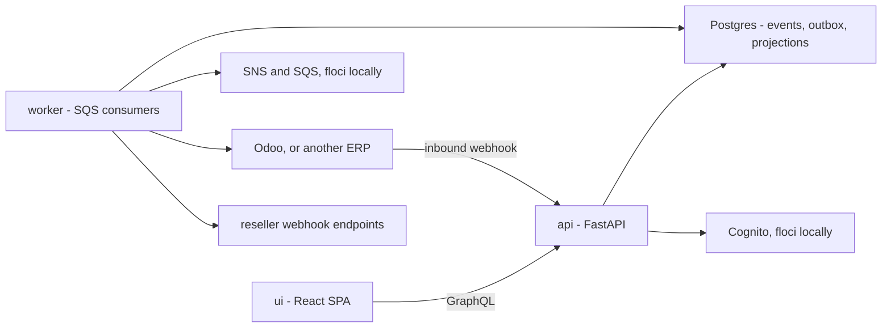

# ERP & Supply Chain Order Portal

A multi-tenant portal that routes a reseller order to the ERP on the quote's subsidiary
(Odoo today; more via a small registration checklist — see `docs/adding-an-erp.md`), with
event-sourced orders, a transactional-outbox/SNS/SQS async pipeline, and a GraphQL API
split by audience (reseller vs. operator, so ERP identity never reaches a reseller — FR-19).

**Start here for how it actually works**:
`aidlc-docs/inception/application-design/target-architecture.md` (the one architecture
doc — AI-DLC's design-of-record, kept current in place rather than forked into a second
file; its "Implementation status" note at the top lists what changed since it was
drafted), `docs/database-schema.md` (every table), and
`docs/event-sourcing-explained.md` (why events instead of just updating rows).

## New here? What you're actually getting into

**It's a modular monolith, not microservices.** Every bounded context in `src/modules/`
(`sales/` — ordering, quoting, shipment, invoicing; `reference/` — connections, tenancy;
`integration/` — erp, webhooks_inbound, webhooks_outbound) runs inside the **same two
Python processes** — `api` and `worker` —
sharing one codebase and one Postgres database. Modules call each other through plain
Python function calls behind ports (interfaces), not network calls; nothing is deployed
or scaled independently. The only real process boundary is `api` ↔ `worker`, and even
that talks through Postgres + SQS, not direct RPC. This was a deliberate choice (see
`aidlc-docs/aidlc-state.md`'s Architectural Decisions): clean module boundaries so it
*could* be split into services later if a specific module ever needs independent scaling,
without paying microservices' operational cost (service discovery, distributed tracing,
network failure modes) up front for a system that doesn't need it yet.

**The three moving parts, in plain terms:**

| Process/service | What it does | Talks to |
|---|---|---|
| **`api`** (FastAPI) | Serves GraphQL (`/graphql/reseller`, `/graphql/operator`) and inbound ERP webhooks. Handles reads and synchronous writes (place/cancel an order). | Postgres, Cognito (auth) |
| **`worker`** | Five SQS consumers (order-processing, order-delivery, order-fulfillment, projections, webhook-dispatch), the outbox relay, and the reconciliation sweeper. Talking to the ERP, building read models, and sending webhooks happens here, not in `api`. | Postgres, SQS/SNS, the ERP (Odoo), reseller webhook endpoints |
| **`ui`** (React SPA) | Reseller portal (notifications, then the order) and operator admin. Talks to `api` over GraphQL only. | `api` |



**One database, two read models.** Writes to the transactional aggregates (`Order`,
`Shipment`, `Invoice`) go through events (`docs/event-sourcing-explained.md`); everything
else (connections, bindings, quotes) is plain CRUD rows. Same Postgres instance either
way — there's no second datastore to stand up.

## Tech stack
**Backend**: Python 3.11 · FastAPI + Strawberry GraphQL · SQLAlchemy + PostgreSQL (event
store + outbox + projections + config, one database) · boto3 against SNS/SQS/Secrets
Manager/Cognito (floci locally, real AWS in prod — identical code either way) · pytest +
Hypothesis · Alembic migrations.

**Frontend** (`ui/`): React 18 + TypeScript + Vite · TanStack Query (data fetching/cache,
no Apollo) · a hand-rolled GraphQL client and Cognito auth client (no SDKs) · plain CSS
against a small design-token system — no component framework. Builds to static files,
deployable to S3/CloudFront; no Node server in production.

## Project layout
```
src/
  api/               # FastAPI app: GraphQL (reseller + operator schemas), HTTP webhooks/health
  worker/            # SQS consumers, outbox relay, reconciliation scheduler
  composition.py     # the one place the object graph is wired (memory | postgres profile)
  modules/           # sales/ (ordering, quoting, shipment, invoicing),
                     # reference/ (connections, tenancy),
                     # integration/ (ERP adapters + status mapping, webhooks_inbound,
                     # webhooks_outbound)
                     # each has domain/ (pure), application/ (ports+services),
                     # infrastructure/ (memory + postgres adapters), tests/ (co-located)
  shared/            # eventsourcing kernel, messaging, persistence, secrets, config, types
ui/                  # React SPA (reseller + operator web app) — see "Tech stack" and
                     # "Run locally" below; no separate ui/README.md
migrations/          # Alembic
tests/e2e/           # full in-memory flow (place order -> deliver -> webhook -> projection)
tests/integration/   # against real Postgres + floci (self-skip if unreachable)
scripts/             # local.sh (start/stop), messaging_bootstrap.py, seed_demo.py,
                     # seed_cognito.py, odoo-boot.sh,
                     # dev_webhook_receiver.py (dev-only test aid, NOT part of the app)
docs/                # local-setup.md, database-schema.md, event-sourcing-explained.md,
                     # erp-integration-patterns.md, adding-an-erp.md, odoo-webhook-setup.md,
                     # mapping/ (canonical<->ERP field tables), erps/ (per-ERP knowledge base)
                     # (architecture itself: aidlc-docs/.../target-architecture.md — one doc)
```

## Run locally

One-time setup, from the repo root:

```bash
python -m venv .venv
. .venv/Scripts/activate          # Windows Git Bash; source .venv/bin/activate on macOS/Linux
pip install -e ".[dev]"
cd ui && npm install && cd ..
```

Then:

```bash
bash scripts/local.sh up          # Postgres, Floci, Odoo, migrate, seed, api, worker, portal
bash scripts/local.sh down        # stop those processes and containers; databases are kept
```

`up` is safe to run again. It restarts api, worker, and the portal so they pick up the
current env, and it waits until `GET /livez` answers. Logs are `.local/api.log`,
`.local/worker.log`, and `.local/ui.log`. The first Odoo boot installs modules and takes
a few minutes. `down` does not delete Docker volumes.

Sign in at the portal as `demo-operator` (operator admin) or `demo-reseller` (notifications
only). Password for both: `DemoPass123!`. Odoo is `admin` / `admin`. The seeded quote is
`qte_demo` for tenant `tnt_demo`, SKU `DEMO-BOX`. Set that Internal Reference on a product
in Odoo before a live submit will find it.

Odoo may show a sticky banner, "Registration failed - push service not available". That is
the browser refusing desktop notifications on this local site. Dismiss it. It does not
block sales.

| What | URL |
|---|---|
| Reseller and operator portal | http://localhost:5173 and http://127.0.0.1:5173 |
| API liveness | http://127.0.0.1:8000/livez |
| API readiness | http://127.0.0.1:8000/readyz |
| Reseller GraphQL | http://127.0.0.1:8000/graphql/reseller |
| Operator GraphQL | http://127.0.0.1:8000/graphql/operator |
| Odoo inbound webhook (shared secret in the path) | http://127.0.0.1:8000/erp/webhook/conn_odoo_local/odoo-webhook-demo |
| HMAC inbound webhook | http://127.0.0.1:8000/erp/webhook/{connection_id} |
| Odoo | http://localhost:8069 |
| Floci (AWS emulator) | http://localhost:4566 |
| Floci health | http://localhost:4566/_floci/health |
| Floci console | http://localhost:4566/_floci/ui |
| Portal Postgres | `localhost:5432`, database `portal`, user `portal`, password `portal` |

The portal calls Floci Cognito through the Vite proxy at `/cognito-idp` (Floci does not
send browser CORS headers). `scripts/local.sh` writes `ui/.env` with the pool and client
ids. Do not copy `ui/.env.example` over that file after `up`.

The same steps by hand, including a machine-to-machine token, are in `docs/local-setup.md`.
`npm run build` in `ui/` produces the static `dist/` folder that gets deployed as-is.

Optional — watch outbound webhook deliveries land during dev:
```bash
python -m scripts.dev_webhook_receiver --port 8090 --secret <the endpoint's signing secret>
```
A standalone, dependency-free test aid (see the file's own docstring) — not something the
app itself starts or depends on.

## Adding a new ERP
`docs/adding-an-erp.md` — four touch points (a status mapper, an adapter, one registry
line, one enum member), no changes anywhere else. `docs/erps/` is the knowledge base for
each ERP once it's registered (auth quirks, API shape, gotchas found the hard way).
`docs/odoo-webhook-setup.md` covers the optional inbound-webhook side specifically.

## Run tests
Backend:
```bash
pip install -e ".[dev]"
pytest src tests
```
Everything under `src/*/tests/` and `tests/e2e/` is DB-free (pure logic + in-memory
adapters). `tests/integration/*` needs a real Postgres (and some, floci) — they self-skip
with a clear reason if unreachable rather than failing.

Frontend:
```bash
cd ui
npm run build      # tsc --noEmit && vite build — typecheck + production build in one step
```
