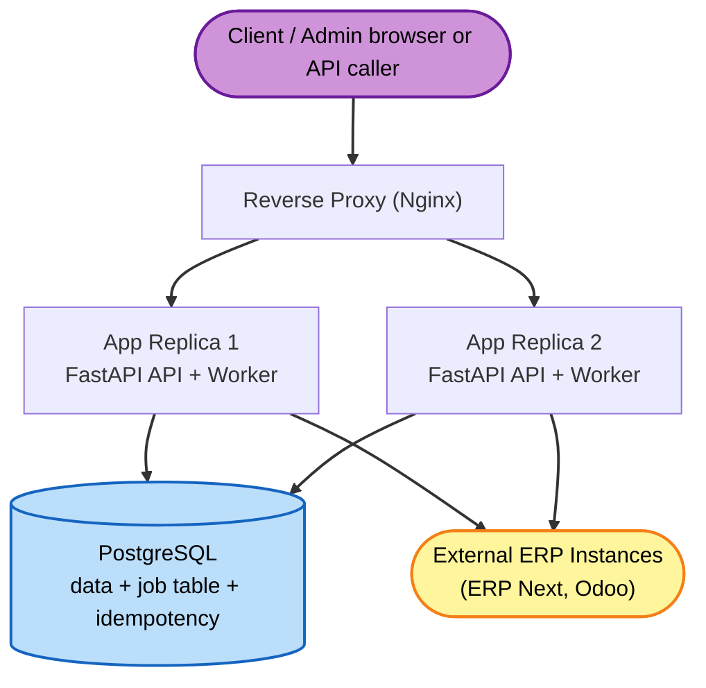

# Deployment Architecture — U0 Platform Foundation (PoC)

## Topology (docker-compose, local PoC)



### Text Alternative
```
Client/Admin -> Reverse Proxy (Nginx) -> {App Replica 1, App Replica 2}
Each App Replica: FastAPI API + in-process job poller/workers
Both App Replicas -> PostgreSQL (application data + job queue table + idempotency table)
Workers in each replica -> External ERP instances (ERP Next, Odoo)
Job double-processing prevented by SELECT ... FOR UPDATE SKIP LOCKED
```

## Components
- **Reverse Proxy (Nginx)**: single entry point; round-robins to the 2 app replicas; terminates HTTP for the PoC.
- **App Replica x2**: identical containers, each serving the API and running the job poller/workers (Q3=A). Stateless except for shared DB.
- **PostgreSQL**: one container with a persistent volume. Holds tenant data, config (instances/routing/mappings), the job table, and the idempotency table.

## Runtime Behavior
- API requests: proxy -> either replica -> handles synchronously (validate, persist, enqueue) -> returns.
- Async work: each replica's poller claims PENDING jobs via `FOR UPDATE SKIP LOCKED`; only one replica processes a given job.
- Status sync: a scheduled poll within the worker loop (and/or webhook endpoint exposed via the proxy) — implemented in U3.

## Scaling & Portability Notes
- To scale: add more app replicas (workers scale with them; SKIP LOCKED keeps them safe).
- To go cloud: same images behind a managed load balancer, managed Postgres, platform-collected stdout logs; env contract unchanged.
- First extraction candidate (U3 Integration) can later run as its own worker service pulling from the same or a dedicated queue.

## Environment Contract (key env vars, PoC)
- `DATABASE_URL` — Postgres connection
- `APP_ROLE` — (optional) api|worker|both (default: both)
- `POLL_INTERVAL_MS`, `JOB_MAX_ATTEMPTS`, `RETRY_BACKOFF_CAP_MS`
- `LOG_LEVEL`
