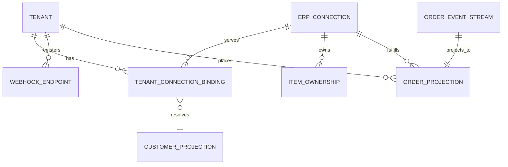

# Domain Entities — U1 Platform Foundation

The foundational domain model every other unit builds on. Three groups:
1. **Value objects** — immutable, no identity.
2. **Event-sourced aggregate** — `Order` (state is a stream of events; Axon).
3. **Reference/config entities** — normal CRUD (soft-deleted, optimistic-locked).
Plus the **read-model projections** that reads are served from (CQRS).

Conventions (Q8): times UTC `Instant` (ISO-8601); currency ISO-4217; country ISO-3166 alpha-2; money/quantity `BigDecimal`; IDs are prefixed, time-sortable (UUIDv7/ULID) — `ord_`, `po_`, `itm_`, `cust_`, `conn_`, `bind_`, `tnt_`, `whk_`, `aud_` (Q1=A). Reference/config aggregates carry a `version` for optimistic concurrency; `Order` uses Axon's sequence.

---

## 1. Value objects
```
Money(BigDecimal amount, String currencyCode)              // ISO-4217; amounts as-is from ERP; half-up at display (Q4=A)
Quantity(BigDecimal value, String unitOfMeasure)
Address(line1, line2, city, region, postalCode, countryCode)
OrderType = SALES | PURCHASE
OrderLifecycleStatus = DRAFT | SUBMITTED | VALIDATED | SENT_TO_ERP | CONFIRMED | FULFILLED | CLOSED | RETRYING | REJECTED
```

## 2. Event-sourced aggregate: `Order`
- **Identity**: `orderId` (`ord_…`) = Axon aggregate id (Q6).
- **State (rebuilt by replaying events)**: `tenantId`, `type`, `status`, `externalReference`, `customerRef`, `currencyCode`, `lines[]`, `totals`, `owningConnectionId` (internal), `erpOrderId` (internal, set at send), timestamps.
- **Not stored as a row** — its truth is the event stream in the Axon event store; a `Projection` derives queryable rows.
- **Upcasters** handle event schema evolution (Q6). **No snapshotting in the MVP** (short streams); enable later (NFR/Infra Design).

`PurchaseOrder` follows the same shape with `supplierRef` instead of `customerRef`.

## 3. Reference/config entities (CRUD, soft-delete Q7)
| Entity | Id | Key fields | Uniqueness / rules |
|---|---|---|---|
| `Tenant` (reseller) | `tnt_…` | displayName, status(active/disabled), cognitoClientId | one per reseller |
| `ErpConnection` (instance) | `conn_…` | erpType(ODOO/ERPNEXT), instanceLabel*, baseUrl, authConfig(encrypted), capabilities, status | operator-only identity |
| `TenantConnectionBinding` | `bind_…` | tenantId, connectionId, erpCustomerId*, status(TO_VERIFY/VERIFIED) | **UNIQUE(tenantId, connectionId)** and **UNIQUE(connectionId, erpCustomerId)** (AC-05) |
| `ItemOwnership` | — | sku, owningConnectionId, status(owned/conflict) | one owner per sku; conflict flagged (AC-06) |
| `WebhookEndpoint` | `whk_…` | tenantId, url, signingSecretHash, state(active/paused/deactivated) | secret shown once, stored hashed |
| `AuditEntry` | `aud_…` | actor, action, targetRef, before, after, occurredAt | append-only; not deletable by app roles |

`*` internal / operator-only fields — never in reseller DTOs (FR-19).

Items and Customers are **projections of ERP-synced data** (read-only to resellers), each carrying an internal `owningConnectionId` / `erpCustomerId` stripped from reseller views.

## 4. Read-model projections (CQRS)
Built by `@EventHandler` projectors from `Order` events and by ERP-sync from U2/U3:
`order_summary`, `order_detail`, `order_timeline`, `delivery_view`, `item_view`, `customer_view`. Keyed for the queries they serve — e.g. `order_summary(tenantId, status)`; `delivery_view(connectionId, erpOrderId)` for reverse routing (`tenancy-and-routing.md` §4).

## 5. Entity relationships



Text: a Tenant has many bindings; each binding links it to one ErpConnection and one ERP customer. Connections own items. Orders (event-sourced) project to `order_projection`, carrying `tenantId` (reseller) and `owningConnectionId` (instance). Reverse routing keys on `(connectionId, erpOrderId)` in the order/delivery projection.

## 6. Data-layer isolation (Q2=X)
- **Application-level**: an enforced tenant filter via `TenantContext` on every query + object-level ownership checks (defense-in-depth, SECURITY-11).
- **PostgreSQL RLS backstop**: RLS policies on **projection tables and reference/config tables** (bindings, endpoints, item ownership, audit) bound to the app-query DB role, so a missing `WHERE tenant_id` cannot leak cross-tenant.
- **Not** on Axon's internal event-store tables (`domain_event_entry`, etc.): those are accessed only by the framework/projector via a **privileged DB role that bypasses RLS** and are never queried tenant-scoped.
