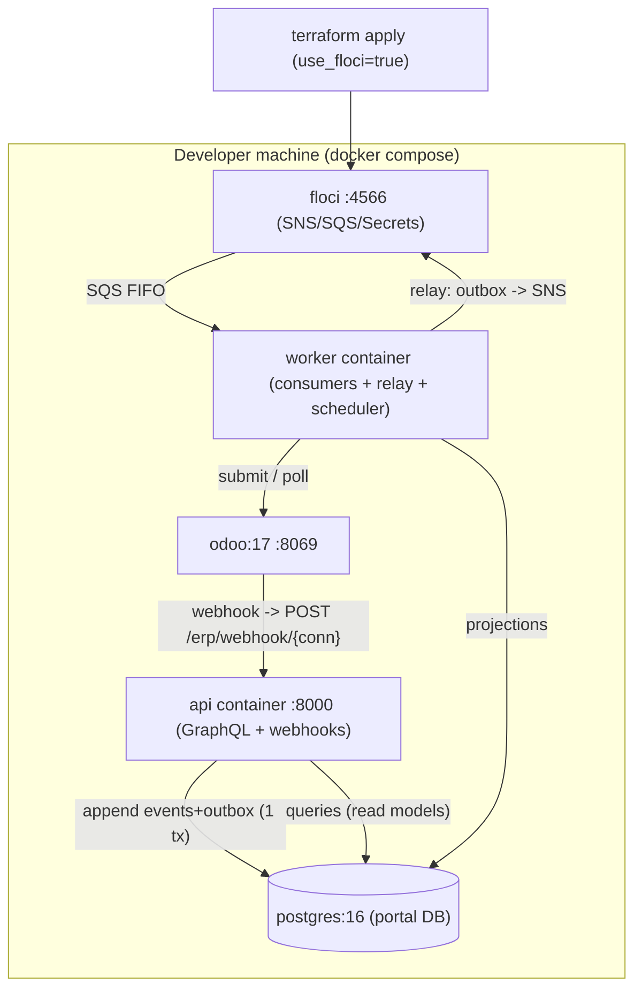
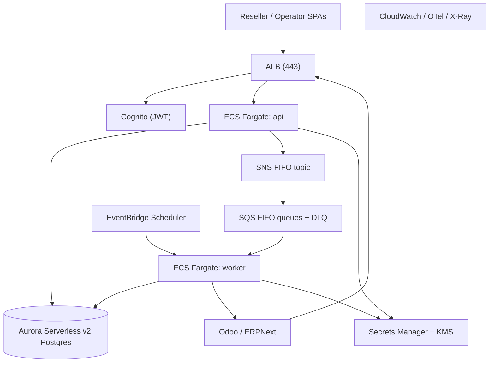

# Deployment Architecture — Target Architecture (Phase 3)

## Local (floci) — the full async E2E you can run on a laptop

Bring-up: `docker compose up -d` → `terraform -chdir=infra/terraform apply -var-file=envs/local.tfvars` → `alembic upgrade head` → `python -m scripts.seed_demo` → api+worker containers start → configure Odoo Automation Rule.

## AWS (production)

Provisioned by Terraform (`use_floci=false`): VPC + private subnets, Aurora, ECS cluster/services/task-defs, ALB + target groups, Cognito user pools + app clients, SNS/SQS, Secrets Manager, IAM roles, ECR, CloudWatch log groups, EventBridge Scheduler.

## Parity: what changes local → prod
| Concern | Local (floci) | AWS |
|---|---|---|
| Messaging | floci SNS/SQS via `AWS_ENDPOINT_URL` | real SNS/SQS |
| Secrets | floci Secrets Manager | Secrets Manager + KMS |
| DB | postgres container | Aurora Serverless v2 |
| Compute | api/worker containers | ECS Fargate |
| Ingress | api :8000 direct | ALB :443 |
| Identity | JWT/header stub | Cognito |
| Provisioning | `terraform … local.tfvars` | `terraform … aws.tfvars` |

Only endpoints + credentials + the AWS-only module toggle differ — application code is identical (ports + `AWS_ENDPOINT_URL`).
