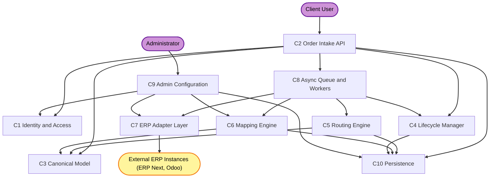

# Component Dependencies — ERP & Supply Chain Order Portal

## Dependency Matrix

Rows depend on columns (✔ = "depends on / calls").

| Depends on ↓ / → | C1 Id | C2 API | C3 Canon | C4 Lifecycle | C5 Route | C6 Map | C7 Adapter | C8 Queue | C9 Admin | C10 Persist |
|---|---|---|---|---|---|---|---|---|---|---|
| C2 Order Intake API | ✔ | — | ✔ | ✔ | | | | ✔ | | ✔ |
| C4 Lifecycle Manager | | | ✔ | — | | | | ✔ | | ✔ |
| C5 Routing Engine | | | ✔ | | — | | | | | ✔ |
| C6 Mapping Engine | | | ✔ | | | — | | | | ✔ |
| C7 ERP Adapter | | | | | | | — | | | |
| C8 Queue & Workers | | | | ✔ | ✔ | ✔ | ✔ | — | | ✔ |
| C9 Admin Config | ✔ | | | | | ✔ | ✔ | | — | ✔ |

Notes:
- C3 Canonical Model is a shared contract; many components reference its types.
- C10 Persistence is a shared dependency for stateful components.
- C7 Adapters are leaf components (depend only on external ERP APIs and the connection details passed in).

## Communication Patterns
- **Synchronous (in-process calls in the monolith; HTTP/RPC when extracted)**:
  - Client -> C2 Order Intake API (portal requests)
  - C2 -> C1 (auth/context), C2 -> C3 (validate), C2 -> C10 (persist), C2 -> C4 (initial record)
  - C9 Admin -> C10, C9 -> C7 (connectivity), C9 -> C6 (validate mapping)
- **Asynchronous (internal queue)**:
  - C2 -> C8 (enqueue submission / corrective jobs)
  - C8 workers -> C5 (route) -> C6 (map) -> C7 (adapter call) -> C4 (record outcome)
  - Status sync: scheduler/webhook -> C8 -> C7.fetchStatus / receiveWebhook -> C6 (map inbound) -> C4.applyStatusUpdate

## Data Flow — Order Submission (text)
```
Client
  -> C2 Order Intake API
       -> C1 resolveContext/authorize
       -> C3 validate(canonicalOrder)
       -> C10 persist order (state=Submitted, tenant-scoped)
       -> C8 enqueue(submissionJob)
       <- ack (orderId, Submitted)
[async]
  C8 worker processSubmission
       -> C5 route(order) -> instanceId | NoMatch
          (NoMatch -> C4 mark Failed "no route matched"; stop)
       -> C6 toErp(order, instanceId) -> ErpPayload
       -> C7 adapter.submit(ErpPayload, conn) -> ErpRef | error
       -> C4 recordSubmission/applyStatusUpdate (Accepted/Failed)
```

## Data Flow — Status Sync (text)
```
Scheduler tick OR ERP webhook
  -> C8 processStatusSync / receiveWebhook
       -> C7 adapter.fetchStatus(erpRef, conn)  (poll case)
       -> C6 fromErp(nativeStatus, instanceId) -> CanonicalOrderStatus
       -> C4 applyStatusUpdate(orderId, canonicalStatus)  (latest-wins + history)
```

## Dependency Diagram (Mermaid)



### Text Alternative (dependency overview)
```
Client -> C2 Order Intake API
Administrator -> C9 Admin Configuration

C2 depends on: C1, C3, C4, C8, C10
C8 (workers) depends on: C5, C6, C7, C4
C5 depends on: C3, C10
C6 depends on: C3, C10
C4 depends on: C10 (and C3 types)
C7 depends on: External ERP instances
C9 depends on: C1, C6, C7, C10
```
