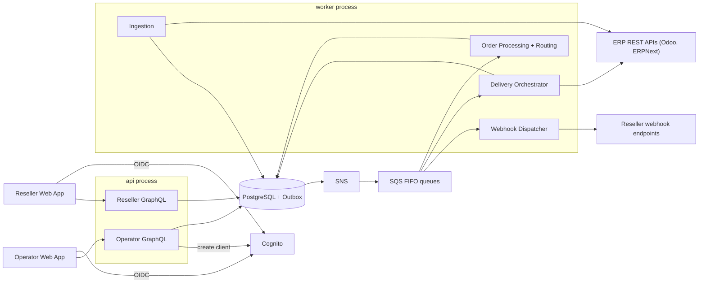

# Component Dependencies & Data Flows — ERP & Supply Chain Order Portal

Dependencies, communication patterns, data flows, and the screen→component mapping. Complements `components.md`, `component-methods.md`, and `services.md`.

---

## 1. Dependency matrix

"Depends on" = calls, or consumes events produced by. Shared modules (C-01..C-06) are used broadly.

| Component | Depends on |
|---|---|
| C-15 Reseller API | C-07, C-08b(read), C-09(read), C-13, C-05, C-04, C-01, C-06 |
| C-16 Operator Admin API | C-16 svcs, C-09, C-08b, C-10(config/conformance), C-11(triage), C-14, C-05, C-04 |
| C-07 Ordering | C-02, C-03(outbox), C-08, C-14, C-01 |
| C-08 Routing | C-08b(item ownership), C-02, C-01 |
| C-08b Catalog & Item Ownership | C-10(sync), C-02, C-14 |
| C-09 Customers & Bindings | C-10(verify), C-02, C-14 |
| C-10 ERP Integration | C-02(config/creds), C-05(cipher), C-01, C-06 |
| C-11 Delivery & Reliability | C-03(SQS), C-10(ErpGateway), C-07(lifecycle), C-02 |
| C-12 Ingestion | C-10(ErpGateway), C-07(lifecycle), C-03(outbox), C-02 |
| C-13 Webhooks & Delivery Log | C-03(SNS/SQS), C-02, C-05, C-01 |
| C-14 Audit | C-02 |
| C-17 Reseller Web App | C-15 (GraphQL `/graphql`), C-04 (OIDC) |
| C-18 Operator Web App | C-16 (GraphQL `/admin/graphql`), C-04 (OIDC) |
| C-19 Developer Enablement | compose stack, seed CLI → C-02, C-10, C-09 |

**Cycle check**: no cyclic dependencies. `api` and `worker` communicate only via the outbox/SNS/SQS (events), never direct calls. Reseller components never depend on ERP-identity-bearing types (C-01 keeps reseller and admin DTOs separate).

---

## 2. Communication patterns
- **Synchronous (in-process)**: GraphQL resolver → application service → repository (PostgreSQL). Used for all reads and command intake.
- **Asynchronous (cross-process)**: transactional outbox → SNS topic → per-consumer SQS FIFO queue (MessageGroupId = order id). Used for order processing, delivery, ingestion follow-ups, and webhook dispatch.
- **Outbound HTTP**: `ErpGateway` → ERP REST APIs (worker only), with timeouts, circuit breakers, and bulkheads per connection (RESILIENCY-10).
- **Outbound HTTP**: `WebhookDispatcher` → reseller endpoints (signed).
- **AWS APIs (behind interfaces)**: Cognito (identity), SQS/SNS (messaging), Secrets Manager/KMS (config/keys) — emulated by Floci locally.

---

## 3. System data flow (Mermaid)

### Text alternative
- Both web apps authenticate via Cognito (OIDC) and call their own GraphQL endpoint.
- `api` reads/writes PostgreSQL directly; state changes also write outbox rows.
- Outbox → SNS → SQS FIFO fans out to worker consumers (order processing/routing, delivery, webhook dispatch).
- Delivery and Ingestion are the only components that call ERP REST APIs; both update PostgreSQL.
- Webhook dispatcher calls reseller endpoints; operator onboarding calls Cognito to create app clients.

---

## 4. Screen → component / route / API mapping

| Screen (design/) | Route | App | Backend component(s) | Key operations |
|---|---|---|---|---|
| Main | /orders | Reseller (C-17) | C-15 → C-07 | list orders, status counts |
| OrderDetail | /orders/:id | Reseller | C-15 → C-07, C-13 | order+timeline, deliveries |
| DeliveryLog | /deliveries | Reseller | C-15 → C-13 | delivery list, replay |
| WebhookEndpoints | /webhooks | Reseller | C-15 → C-13 | manage endpoints, signing secret |
| AdminTenants | /admin/resellers | Operator (C-18) | C-16 → OnboardingService | reseller list, onboard |
| AdminTenantDetail | /admin/resellers/:id | Operator | C-16 → BindingService, OnboardingService | bindings, verify, API client |
| AdminConnections | /admin/connections | Operator | C-16 → AdminOpsService, C-10 | connection health, settings |
| AdminItemOwnership | /admin/items/ownership | Operator | C-16 → ItemOwnershipService | conflicts, resolve |
| AdminFailedMessages | /admin/failed-messages | Operator | C-16 → AdminOpsService, C-11 | retrying/rejected/dead-lettered, retry |
| AdminAudit | /admin/audit | Operator | C-16 → AuditService | audit trail |
| Sign in | (not yet designed) | Both | C-04 (Cognito Hosted UI / OIDC) | authenticate |
| New-order form | (not yet designed) | Reseller | C-15 → C-07 | create order |
| Item catalog | (not yet designed) | Reseller | C-15 → C-08b | browse items |
| Mapping viewer | (not yet designed) | Operator | C-16 → AdminOpsService | view mappings (read-only, Q2=B) |

---

## 5. Extension-constraint touchpoints (carried into design)
- **SECURITY**: C-05 (isolation/authz), C-04 (token validation), C-15 (input validation/rate limit), C-01 (DTO separation for FR-19), C-14 (audit).
- **RESILIENCY**: C-03 (durable queue/DLQ), C-11 (retry/idempotency), C-10 (timeouts/circuit breakers/bulkheads), C-06 (health/metrics), C-12 (degraded-mode reads).
- **PBT**: C-10 MappingEngine (round-trip), C-11/C-12 (idempotent processing), C-08 (routing determinism), C-09/C-08b (uniqueness invariants), C-07 (lifecycle state machine model) — property identification formalized in Functional Design (PBT-01).
