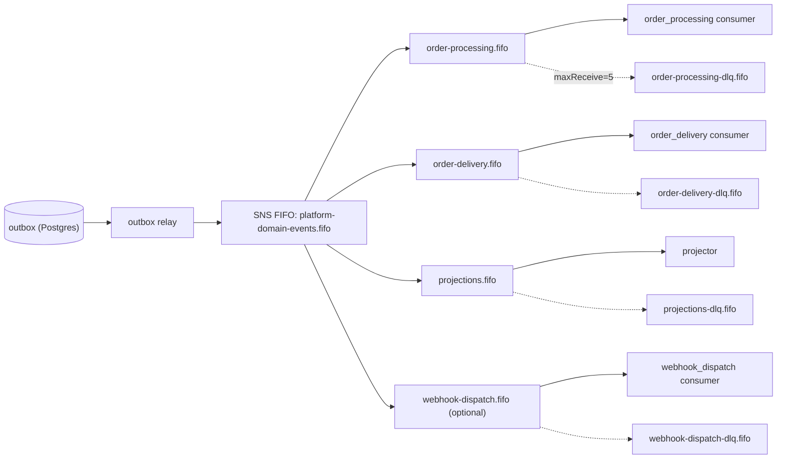

# Messaging Topology — locally runnable, testable, industry-standard

Locks the queues, topic, and delivery semantics. Pattern is the textbook AWS one:
**transactional outbox → SNS FIFO topic → SQS FIFO queues → idempotent consumers → DLQ**.
Everything sits behind ports so we get three interchangeable runtimes with the *same* code.

## 1. Three runtimes, one code path (the key idea)
The domain/consumers only touch our `EventPublisher` / `MessageConsumer` ports. Adapters:

| Runtime | Adapter | Used for | How |
|---|---|---|---|
| **In-memory** | `InMemoryMessageBus` | unit tests | synchronous, deterministic, no Docker |
| **floci (local AWS)** | boto3 → `http://floci:4566` | local dev + integration/e2e tests | real SNS/SQS FIFO APIs, no cloud account |
| **AWS** | boto3 (default endpoint) | prod | provisioned by CDK |

floci and AWS use the **identical boto3 code** — only `AWS_ENDPOINT_URL` + creds change. So "runs locally" and "runs in prod" exercise the same paths.

## 2. Why this shape (industry standard)
- **Transactional outbox** removes dual-write: the event + outbox row commit in one DB tx; the relay publishes. No lost/ghost events.
- **SNS FIFO → SQS FIFO** (not EventBridge for the ordered path): SNS FIFO propagates a **per-message `MessageGroupId`** (= `aggregateId`) and a **`MessageDeduplicationId`** (= `eventId`). EventBridge→SQS-FIFO only allows a *static* group id, which breaks per-order ordering — so EventBridge is reserved for later non-ordered/analytics routing, not the core.
- **Per-order ordering, cross-order parallelism**: `MessageGroupId = orderId`.
- **At-least-once + idempotent consumers**: dedup on `eventId` (publish-side `MessageDeduplicationId` + consumer-side processed-events table).
- **DLQ per queue** with redrive for operator triage (AdminFailedMessages).

## 3. Topology


**Topic:** `platform-domain-events.fifo` (SNS FIFO). All domain + integration events publish here.

**Queues (SQS FIFO), each subscribed with an SNS filter policy on `eventType`, each with a DLQ:**

| Queue | Subscribes to (eventType filter) | Consumer | DLQ |
|---|---|---|---|
| `order-processing.fifo` | `OrderSubmitted`, `OrderAmended` | `worker/consumers/order_processing.py` (validate + ownership routing) | `order-processing-dlq.fifo` |
| `order-delivery.fifo` | `OrderReadyForDelivery`, `OrderCancellationRequested` | `worker/consumers/order_delivery.py` (ERP submit/cancel) | `order-delivery-dlq.fifo` |
| `projections.fifo` | all events | `worker/consumers/projector.py` (build read models) | `projections-dlq.fifo` |
| `webhook-dispatch.fifo` *(optional/secondary)* | `OrderSentToErp`, `OrderConfirmed`, `OrderFulfilled`, `OrderClosed`, `OrderRejected`, `OrderRetrying` | `worker/consumers/webhook_dispatch.py` | `webhook-dispatch-dlq.fifo` |

**Not queues:** inbound ERP webhook = HTTP ingress → outbox → topic (no ingress queue in the base; add one only if inbound volume needs buffering). Reconciliation = EventBridge Scheduler (cron). Outbox relay = the publisher.

## 4. Message settings (locked)
- `MessageGroupId = aggregateId` (order id) — per-order FIFO ordering.
- `MessageDeduplicationId = eventId` — content-based dedup **off**; producer sets it explicitly.
- Consumer idempotency: a `processed_events(consumer, event_id)` table; skip if seen (handles at-least-once + redrive).
- Redrive: `maxReceiveCount = 5`; visibility timeout ≥ max handler time (start 30s); exponential backoff between attempts.
- Ordering + monotonic state: consumers ignore stale/backward transitions (lifecycle is monotonic), so out-of-order or duplicate delivery is safe.

## 5. Local run with floci
`docker-compose.yml` gains a floci service; the app + workers get the AWS env pointed at it.
```yaml
  floci:
    image: floci/floci:latest
    ports: ["4566:4566"]
  # app/worker env:
  #   AWS_ENDPOINT_URL=http://floci:4566
  #   AWS_DEFAULT_REGION=us-east-1
  #   AWS_ACCESS_KEY_ID=test  AWS_SECRET_ACCESS_KEY=test
```
- **Provisioning**: `scripts/messaging_bootstrap.py` (boto3, idempotent) creates the topic, queues, DLQs, subscriptions, filter policies, and redrive policies. Runs against floci locally; the same resource definitions are expressed as **CDK** for AWS. One `make messaging-up` target.
- `docker compose up` → floci + postgres + odoo + app → `alembic upgrade head` → `python -m scripts.messaging_bootstrap` → ready.

## 6. Testing strategy
- **Unit** (fast, no Docker): `InMemoryMessageBus` — deterministic publish/consume; used for consumer logic, ordering rules, idempotency.
- **Integration** (CI, Docker): floci-backed — verifies real SNS/SQS **FIFO semantics** (group ordering, dedup, redrive→DLQ). Runnable via docker-compose or Testcontainers.
- **e2e**: `tests/e2e/` — full flow order → processing → delivery (stub/real Odoo) → projection → (optional) webhook, over floci.

## 7. Be upfront: the one risk
Local AWS emulators can differ from real AWS on **FIFO edge cases** (strict ordering, dedup windows, redrive timing). So:
- Unit tests use the in-memory bus for **deterministic** guarantees.
- floci is **high-fidelity-but-verify** for integration — we add a small suite asserting ordering/dedup/DLQ actually behave.
- Ordering-critical correctness must also be validated against **real AWS in a staging env** before go-live; "works on floci" is necessary, not sufficient.
- Verification checklist before relying on floci: SNS FIFO topics, SQS FIFO queues, subscription **filter policies**, `MessageGroupId` ordering, `MessageDeduplicationId`, and redrive→DLQ all supported. If any gap, that queue falls back to the in-memory bus for tests and we note it.

## 8. Ports (so none of the above leaks into the domain)
- `EventPublisher.publish(events: list[StoredEvent]) -> None` — topic publish (group id + dedup id set from the envelope).
- `MessageConsumer` — receive/ack/extend-visibility; hands the consumer a decoded `StoredEvent`; consumers are transport-agnostic.
- Adapters: `InMemoryMessageBus`, `AwsSnsSqsBus` (works against floci and AWS). Selected by config.

## 9. Resolved decisions
- Ordered fan-out via **SNS FIFO → SQS FIFO** (not EventBridge). EventBridge deferred to optional non-ordered routing.
- **Dedicated `projections.fifo`** (projector isolated + independently scalable + own DLQ).
- **`webhook-dispatch.fifo` optional** (outbound webhooks secondary to GraphQL; off by default in base).
- Local runner = **floci**; unit = in-memory; prod = AWS via CDK.
