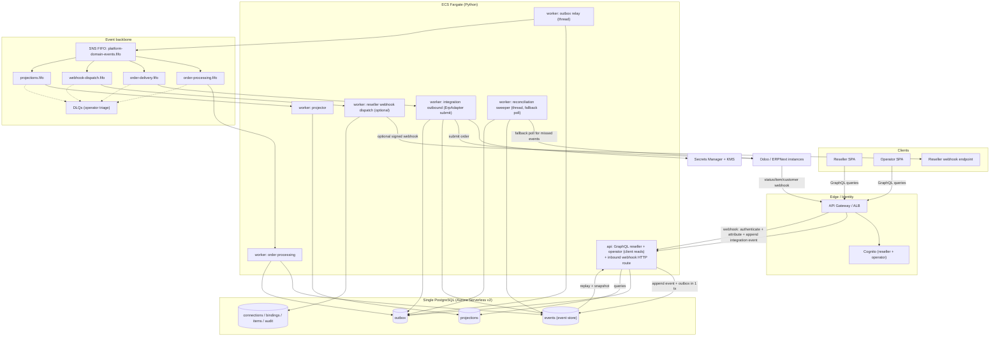

# Target Architecture — ERP & Supply Chain Order Portal (Increment 3)

AWS-native, Python, event-driven, event-sourced (Order only), **GraphQL** API, single
PostgreSQL, binding/ownership tenancy. Managed AWS services live behind ports so the
domain stays portable and locally emulable (floci).

> **Implementation status (updated during Construction, kept current in this one file —
> not a separate doc).** Four things below changed since this was first drafted:
> 1. **Event bus is SNS FIFO → SQS FIFO, not EventBridge** — `messaging-topology.md`
>    supersedes this explicitly: EventBridge → SQS FIFO only supports a *static*
>    MessageGroupId, which breaks per-order ordering. Every mention of EventBridge below
>    is corrected to SNS FIFO.
> 2. **The outbox relay, webhook ingress, and reconciliation sweeper run as part of the
>    `api`/`worker` processes**, not standalone Lambda functions (a FastAPI route for
>    ingress; background threads in `worker` for relay/reconcile). Real Lambda remains a
>    valid later move for serverless scaling — nothing about the ports/architecture
>    prevents it — it just isn't built yet.
> 3. **The event-sourcing kernel is hand-rolled** (`src/shared/eventsourcing/`), not the
>    `eventsourcing` (pyeventsourcing) library §10's O-ESLIB decision called for. See the
>    note on O-ESLIB in §10 for why.
> 4. **No `mapping_definitions` table / declarative mapping engine was built.** Each ERP
>    adapter does its own field-mapping in code — see `docs/adding-an-erp.md`.
>
> **Cognito is now built** (`src/shared/identity/`, `CognitoIdentityProvider`) and
> verified live against a real floci Cognito user pool — see §7 and §11 SEC-08/SEC-12.
> Tenant comes from a `custom:tenant_id` attribute, roles from `cognito:groups`. MFA
> enforcement (SEC-12) is User Pool *provisioning*, not application code — still open,
> item G/Terraform territory. API Gateway vs. ALB (still an open infra decision) and the
> AWS deployment itself (CDK/Terraform) remain **not yet built** — those aren't drift,
> just not-there-yet.

## 1. Style & deployables
- **Modular monolith**, two deployables from one codebase:
  - `api` (ECS Fargate) — GraphQL (reseller + operator schemas): **the primary way clients retrieve data** (queries; optional subscriptions), plus command handling and the inbound ERP webhook route (see implementation-status note above).
  - `worker` (ECS Fargate) — SQS FIFO consumers (order processing, delivery, projector, optional reseller webhook dispatch) **plus** the outbox relay and reconciliation sweeper as background threads in the same process.
- Originally planned as separate Lambda functions (outbox relay; **inbound ERP webhook ingress** — ERP → platform, the primary way we *collect* ERP data; and a scheduled **reconciliation sweeper**, the fallback for missed/dropped webhooks) — see implementation-status note above for why they ended up in `api`/`worker` instead.

## 1a. Data directions (explicit)
- **Collect from ERPs = push.** ERPs (Odoo/ERPNext) call our inbound webhook on order-status/item/customer changes. Polling is demoted to a periodic **reconciliation** safety net, not the primary path.
- **Serve to clients = pull.** Resellers/operators read via **GraphQL**. Reseller *outbound* webhooks (us → reseller, the `WebhookEndpoints` screen) remain available but **optional/secondary** — GraphQL is the primary retrieval channel.
- **Hexagonal**: domain packages are pure Python and depend only on the canonical model; `platform-infrastructure` implements ports (persistence, `EventPublisher`, `ErpAdapter`, identity, crypto, observability). No domain module imports an AWS SDK.

## 2. Component flow


## 3. Command / event-sourcing write path
```mermaid
sequenceDiagram
  actor R as Reseller
  participant GW as API Gateway
  participant API as api (GraphQL)
  participant PG as PostgreSQL
  participant RL as outbox relay
  participant EB as SNS FIFO
  R->>GW: mutation createSalesOrder (JWT)
  GW->>API: authorized (tenant + roles in context)
  API->>PG: load events(aggregateId), replay -> Order
  API->>API: validate input + business + item ownership
  API->>PG: BEGIN; append OrderSubmitted (UNIQUE aggregate_id,version); insert outbox; COMMIT
  API-->>R: ack (orderId, status SUBMITTED)
  RL->>PG: poll outbox (SKIP LOCKED)
  RL->>EB: publish OrderSubmitted
  RL->>PG: mark published
```

## 4. Lifecycle + reverse routing
```mermaid
sequenceDiagram
  participant BUS as SNS FIFO -> SQS FIFO
  participant OW as order worker
  participant IW as integration worker
  participant ERP as Odoo/ERPNext
  participant ING as webhook ingress (api route)
  participant CL as Client (reseller)
  BUS->>OW: OrderSubmitted
  OW->>OW: validate + resolve owningConnectionId (item ownership)
  OW->>OW: mixed-ERP -> OrderRejected ; else OrderValidated + OrderReadyForDelivery
  BUS->>IW: OrderReadyForDelivery
  IW->>ERP: submit via ErpAdapter (JSON-RPC)
  IW->>IW: append OrderSentToErp (store erpOrderId)
  ERP->>ING: webhook: status change (connectionId, erpOrderId, native status)
  ING->>ING: authenticate + verify signature
  ING->>ING: attribute via (connectionId, erpOrderId) -> order -> tenant
  ING->>ING: dedupe (delivery id) + append ErpOrderStatusChanged
  Note over ING: unknown/unattributable -> 200 + ignore (never broadcast)
  BUS->>OW: ErpOrderStatusChanged -> OrderConfirmed/Fulfilled/Closed (projector updates read models)
  CL->>CL: GraphQL query orders/order (tenant-scoped) reflects new status
```

## 5. GraphQL design (contains the enlarged auth surface)
- **Two schemas / endpoints**: `reseller` and `operator`. The reseller schema's types simply do not declare ERP-identity fields, so FR-19 holds by construction, not by runtime filtering.
- **Mutations = commands** (`createSalesOrder`, `cancelSalesOrder`, `amendSalesOrder`, `registerWebhookEndpoint`, `onboardReseller`, `createCustomerBinding`, `resolveItemOwnership`, …). A mutation validates, appends events, returns an ack; side effects flow through events.
- **Queries = projections** (`orders`, `order`, `deliveries`, `webhookEndpoints`; operator adds `resellers`, `connections`, `failedMessages`, `itemOwnership`, `audit`). Resolvers read read-models and are tenant-scoped from context.
- **Guardrails (NFR-GQL-SEC)**: query depth + complexity limits, introspection disabled in prod, persisted queries for cacheable reads, dataloaders to avoid N+1, field-level authorization, per-tenant scoping in every resolver.
- **Runtime**: Strawberry (code-first, typed) inside the Python `api` on Fargate, behind API Gateway/ALB — chosen over AppSync for portability and Python-resolver reuse (O-MANAGED-GQL).
- **Subscriptions**: optional (`orderStatusChanged`) for near-real-time client updates (O-GQL-SUB).
- **Reseller outbound webhooks** (us → reseller) remain available via the `WebhookEndpoints` screen but are **secondary**; GraphQL is the primary client retrieval path.

## 5a. Inbound ERP webhook ingestion (collect from ERPs)
Primary path for ERP → platform data. A thin, fast ingress; heavy work is async.
- **Endpoint**: `POST /erp/webhook/{connectionId}`, an HTTP route in the `api` process (implementation-status note above); behind API Gateway once that's provisioned. Per-connection path so the source connection is explicit. Odoo additionally gets `/erp/webhook/{connectionId}/{webhookSecret}` — see `docs/odoo-webhook-setup.md` for why (it can't sign a body or set headers).
- **Authenticate & verify**: per-connection shared secret / HMAC signature (secret in Secrets Manager), optional source IP allowlist. Reject unauthenticated calls.
- **Attribute before publish (FR-REV)**: resolve tenant via the reverse-routing keys — `(connectionId, erpOrderId)` for orders, `VERIFIED` binding for customer/item events. Unattributable payloads return `200` and are dropped (never broadcast).
- **Thin + async**: validate → append the integration event to the event store + outbox in one tx → return `200` fast. Processing (lifecycle transition, projections) happens off the bus.
- **Idempotent & unordered**: webhooks are at-least-once and may arrive out of order. Dedupe on a delivery id / `(connectionId, erpOrderId, native_status, occurredAt)`; lifecycle transitions are monotonic (ignore stale/backward status).
- **Reconciliation fallback**: a scheduled `reconciliation sweeper` polls each connection for changes since a cursor to catch missed/dropped webhooks. Webhooks are the fast path; reconcile guarantees eventual correctness.
- **ERP enablement caveat**: ERPNext has native webhooks; **Odoo requires Automation Rules** (server action → webhook) to be configured per instance. Onboarding a connection must include this setup step, else that connection silently relies on reconciliation only.

## 6. Single-database layout (PostgreSQL)
- **Order event store (event-sourced) — hand-rolled kernel** (`src/shared/eventsourcing/`), not the `eventsourcing` (pyeventsourcing) library §10's O-ESLIB decision originally called for — see that entry for why. It provides the same guarantees the decision wanted: optimistic-concurrency append, snapshots. Upcasting was not needed yet (no event schema has changed shape). Only the `Order` aggregate uses it — connections/items/bindings are plain CRUD rows with no event trail.
- **Outbox, one mechanism, not two**: `PostgresEventStore.append()` writes the event row AND an `outbox` row in the *same transaction*, for the one aggregate (`Order`) that's event-sourced. There's no separate "non-ES aggregate outbox" — connections/items/bindings changes aren't published as events at all today. One relay (`RelayRunner`) publishes unpublished outbox rows to SNS FIFO.
- **Projections**: `orders` (summary + detail combined into one row) and `order_status_history` (the timeline) — see `docs/database-schema.md` for the full table reference and an ER diagram. No separate `order_summary`/`order_detail`/`delivery_view` tables were built; one `orders` table covers reseller and operator reads (the two GraphQL schemas just expose different fields from it).
- **Config/tenancy**: `erp_connections`, `tenant_connection_bindings`, `items`, `webhook_endpoints`, `audit_log`. No `mapping_definitions` table — the "declarative mapping engine" (§8) wasn't built; each ERP adapter maps fields in code (`docs/adding-an-erp.md`).
- **Secrets are references, not values (SECURITY-12).** `erp_connections.secret_ref` (ERP login) and `webhook_secret_ref` (inbound webhook auth — a *separate* secret, deliberately) store a **Secrets Manager ARN**, never the raw credential. This supersedes the earlier PoC inline-secret posture.
- **Constraints**: `UNIQUE(tenant_id, connection_id)`, `UNIQUE(connection_id, erp_customer_id)`, `UNIQUE(connection_id, erp_order_id)`.
- **Defense in depth**: Postgres row-level security keyed on tenant for reseller-readable projections — policies exist but are currently inert locally (the app's DB role owns the tables, which bypasses RLS by default, and nothing calls `SET app.tenant_id` yet); tenant isolation today is enforced entirely at the application layer. See `docs/database-schema.md`.
- **Migrations**: Alembic (replaces the raw .sql + ad-hoc ALTER).

## 7. Ports (keep AWS a detail)
`EventPublisher` (→ SNS FIFO), `EventStore` (→ hand-rolled kernel on Postgres — §6), `Queue`/consumer (→ SQS FIFO), `SecretStore` (→ Secrets Manager/KMS), `IdentityProvider` (→ Cognito JWKS, `src/shared/identity/`), `ErpAdapter` (→ Odoo today; see `docs/adding-an-erp.md` for adding more), `Clock`/`IdGenerator` (ULID/UUIDv7). Local dev binds these to floci + Postgres container + Odoo container. No separate `MappingEngine` port — mapping is inside each `ErpAdapter`, not a shared service (§6).

## 8. Carried from `main` (unchanged intent, with two exceptions noted)
Event sourcing + CQRS; transactional outbox; event envelope + FIFO per-aggregate ordering; four event families; binding/ownership tenancy + reverse routing + uniqueness; reseller/operator separation (now GraphQL schemas); ports & adapters; Cognito; Secrets Manager/KMS; signed webhooks + DLQ triage; prefixed IDs; item-ownership conflict + audit; observability (OTel) + PBT (Hypothesis) + import-linter boundary checks. **Two exceptions, not carried through**: the **declarative mapping engine** (mapping is per-adapter code instead — §6/§7) and **snapshot upcasters** (no event schema has needed one yet; the kernel supports snapshots, just hasn't needed to upcast one).

## 9. Phased build plan (correctness before cloud)
1. **Domain core on plain Postgres + Fargate, local via floci**: binding/ownership tenancy, `events`+`outbox`, ownership routing (persist `owningConnectionId`), reverse-routing keys, reseller/operator separation, Alembic.
2. **Event-source the `Order` aggregate**: command handlers, replay + snapshots, projectors + read models, GraphQL queries/mutations.
3. **Managed services**: Secrets Manager/KMS for ERP creds, SNS FIFO + SQS FIFO + DLQ, CDK (Python) deploy to ECS Fargate; per-connection circuit breaker. (Outbox relay + reconciliation sweeper are already built, as worker threads rather than standalone Lambda — implementation-status note at the top. Cognito JWT verification is also already built — `src/shared/identity/`; still open: User Pool *provisioning*, i.e. MFA policy, user onboarding — that's infra/admin-tooling, not this line's application code.)

## 10. Resolved decisions
- **O-SEC → YES.** Security baseline is enabled for the target; see §11.
- **O-GQL-SUB → No subscriptions in the base.** Clients retrieve via GraphQL queries (short-poll if needed); subscriptions are a later add-on.
- **O-MANAGED-GQL → Strawberry-in-Python** on Fargate behind API Gateway/ALB (portable, Python resolvers). AppSync rejected for portability.
- **O-INGEST → confirmed.** Inbound webhooks are primary; reconciliation sweeper runs on a schedule (default cadence: every 15 min per connection, tunable). Connection onboarding must include ERP webhook setup (Odoo Automation Rule; ERPNext native webhook — note ERPNext itself isn't currently a registered adapter, see `docs/adding-an-erp.md`).
- **O-ESLIB → `eventsourcing` (pyeventsourcing) on Postgres.** *Decided, not built.* Construction used a small hand-rolled kernel instead (`src/shared/eventsourcing/`, see `docs/event-sourcing-explained.md`) — it meets the same needs (optimistic-concurrency append, snapshots) without the extra dependency, at the cost of not having the library's upcasting machinery if a future event schema change needs it. Revisit if that's ever actually needed. EventStoreDB remains rejected either way (would be a second datastore).

## 11. Security posture (Security baseline — enabled)
Security is a blocking constraint for this target. How each rule is met:

| Rule | How it's addressed |
|---|---|
| SEC-01 Encryption | Aurora encryption at rest (KMS) + TLS-only DB connections; SQS/SNS/Secrets encrypted with KMS; HTTPS only at the edge |
| SEC-02 Intermediary logging | API Gateway access + execution logs; ALB access logs to S3; CloudFront logs |
| SEC-03 App logging | Structured JSON logs + correlationId → CloudWatch; secrets/PII scrubbed |
| SEC-04 HTTP headers | SPA served via CloudFront/S3 with CSP (`default-src 'self'`), HSTS, `X-Content-Type-Options`, `X-Frame-Options: DENY`, `Referrer-Policy` |
| SEC-05 Input validation | GraphQL typed schema + validators; parameterized SQL (SQLAlchemy); query depth/complexity + body-size limits; inbound webhook payload validation |
| SEC-06 Least privilege | Per-service Fargate task roles scoped to specific queues/tables/secrets; no wildcard actions/resources |
| SEC-07 Network | Fargate + Aurora in private subnets; deny-by-default SGs; only ALB/API GW public on 443; VPC endpoints for SQS/SNS/Secrets |
| SEC-08 Access control | Cognito JWT validated per request — user login (ID token) and machine-to-machine (`client_credentials` access token, scoped via OAuth scopes, no human involved) both supported; **object-level authz** (order/binding lookups verify tenant ownership → prevents IDOR); operator role checks server-side; CORS restricted to known SPA origins (CORS itself: not yet built, no SPA exists yet) |
| SEC-09 Hardening | No default creds (Cognito replaces admin/admin); generic prod errors; S3 public access blocked; GraphQL introspection disabled in prod; pinned images |
| SEC-10 Supply chain | Lock file committed; `pip-audit`/Trivy scan in CI; pinned base images (no `:latest`); SBOM for prod |
| SEC-11 Secure design | Access-control isolated in its own module; defense in depth (validation + authz + RLS + encryption); **rate limiting** at API Gateway + per-tenant; abuse cases (webhook replay, order flooding) considered |
| SEC-12 AuthN/credentials | Cognito password policy + breached-password check + **MFA for operators** + session mgmt + brute-force lockout; ERP creds in Secrets Manager (`secret_ref`); no hardcoded secrets |
| SEC-13 Integrity | Typed/safe deserialization (pydantic); **inbound webhook HMAC verification**; SRI for any CDN scripts; CI/CD change control; audit log with before/after |
| SEC-14 Alerting | CloudWatch alarms on auth failures / authz violations; append-only `audit_log` (tamper-evident); log retention ≥ 90 days; dashboards |
| SEC-15 Fail-safe | Global error handler; fail-closed (tenant repo denies without context); tx rollback + resource cleanup on error; generic user-facing errors |

Enforcement: these are verified per stage during Construction; any gap is a blocking security finding.
