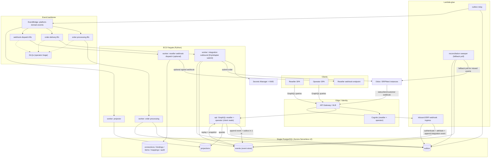

# Target Architecture — ERP & Supply Chain Order Portal (Increment 3)

AWS-native, Python, event-driven, event-sourced (Order only), **GraphQL** API, single
PostgreSQL, binding/ownership tenancy. Managed AWS services live behind ports so the
domain stays portable and locally emulable (floci).

## 1. Style & deployables
- **Modular monolith**, two deployables from one codebase:
  - `api` (ECS Fargate) — GraphQL (reseller + operator schemas): **the primary way clients retrieve data** (queries; optional subscriptions), plus command handling.
  - `worker` (ECS Fargate) — SQS FIFO consumers: order processing, delivery, projector, and (optional) reseller webhook dispatch.
- **Lambda**: outbox relay; **inbound ERP webhook ingress** (ERP → platform, the primary way we *collect* ERP data); and a scheduled **reconciliation sweeper** that polls each connection as a fallback for missed/dropped webhooks.

## 1a. Data directions (explicit)
- **Collect from ERPs = push.** ERPs (Odoo/ERPNext) call our inbound webhook on order-status/item/customer changes. Polling is demoted to a periodic **reconciliation** safety net, not the primary path.
- **Serve to clients = pull.** Resellers/operators read via **GraphQL**. Reseller *outbound* webhooks (us → reseller, the `WebhookEndpoints` screen) remain available but **optional/secondary** — GraphQL is the primary retrieval channel.
- **Hexagonal**: domain packages are pure Python and depend only on the canonical model; `platform-infrastructure` implements ports (persistence, `EventPublisher`, `ErpAdapter`, identity, crypto, observability). No domain module imports an AWS SDK.

## 2. Component flow


## 3. Command / event-sourcing write path
```mermaid
sequenceDiagram
  actor R as Reseller
  participant GW as API Gateway
  participant API as api (GraphQL)
  participant PG as PostgreSQL
  participant RL as outbox relay
  participant EB as EventBridge
  R->>GW: mutation createSalesOrder (JWT)
  GW->>API: authorized (tenant + roles in context)
  API->>PG: load events(aggregateId), replay -> Order
  API->>API: validate input + business + item ownership
  API->>PG: BEGIN; append OrderSubmitted (UNIQUE aggregate_id,version); insert outbox; COMMIT
  API-->>R: ack (orderId, status SUBMITTED)
  RL->>PG: poll outbox (SKIP LOCKED)
  RL->>EB: publish OrderSubmitted
  RL->>PG: mark published
```

## 4. Lifecycle + reverse routing
```mermaid
sequenceDiagram
  participant EB as EventBridge
  participant OW as order worker
  participant IW as integration worker
  participant ERP as Odoo/ERPNext
  participant ING as webhook ingress
  participant CL as Client (reseller)
  EB->>OW: OrderSubmitted
  OW->>OW: validate + resolve owningConnectionId (item ownership)
  OW->>OW: mixed-ERP -> OrderRejected ; else OrderValidated + OrderReadyForDelivery
  EB->>IW: OrderReadyForDelivery
  IW->>ERP: submit via ErpAdapter (JSON-RPC)
  IW->>IW: append OrderSentToErp (store erpOrderId)
  ERP->>ING: webhook: status change (connectionId, erpOrderId, native status)
  ING->>ING: authenticate + verify signature
  ING->>ING: attribute via (connectionId, erpOrderId) -> order -> tenant
  ING->>ING: dedupe (delivery id) + append ErpOrderStatusChanged
  Note over ING: unknown/unattributable -> 200 + ignore (never broadcast)
  EB->>OW: ErpOrderStatusChanged -> OrderConfirmed/Fulfilled/Closed (projector updates read models)
  CL->>CL: GraphQL query orders/order (tenant-scoped) reflects new status
```

## 5. GraphQL design (contains the enlarged auth surface)
- **Two schemas / endpoints**: `reseller` and `operator`. The reseller schema's types simply do not declare ERP-identity fields, so FR-19 holds by construction, not by runtime filtering.
- **Mutations = commands** (`createSalesOrder`, `cancelSalesOrder`, `amendSalesOrder`, `registerWebhookEndpoint`, `onboardReseller`, `createCustomerBinding`, `resolveItemOwnership`, …). A mutation validates, appends events, returns an ack; side effects flow through events.
- **Queries = projections** (`orders`, `order`, `deliveries`, `webhookEndpoints`; operator adds `resellers`, `connections`, `failedMessages`, `itemOwnership`, `audit`). Resolvers read read-models and are tenant-scoped from context.
- **Guardrails (NFR-GQL-SEC)**: query depth + complexity limits, introspection disabled in prod, persisted queries for cacheable reads, dataloaders to avoid N+1, field-level authorization, per-tenant scoping in every resolver.
- **Runtime**: Strawberry (code-first, typed) inside the Python `api` on Fargate, behind API Gateway/ALB — chosen over AppSync for portability and Python-resolver reuse (O-MANAGED-GQL).
- **Subscriptions**: optional (`orderStatusChanged`) for near-real-time client updates (O-GQL-SUB).
- **Reseller outbound webhooks** (us → reseller) remain available via the `WebhookEndpoints` screen but are **secondary**; GraphQL is the primary client retrieval path.

## 5a. Inbound ERP webhook ingestion (collect from ERPs)
Primary path for ERP → platform data. A thin, fast ingress; heavy work is async.
- **Endpoint**: `POST /erp/webhook/{connectionId}` behind API Gateway → `webhook-ingress` Lambda. Per-connection path so the source connection is explicit.
- **Authenticate & verify**: per-connection shared secret / HMAC signature (secret in Secrets Manager), optional source IP allowlist. Reject unauthenticated calls.
- **Attribute before publish (FR-REV)**: resolve tenant via the reverse-routing keys — `(connectionId, erpOrderId)` for orders, `VERIFIED` binding for customer/item events. Unattributable payloads return `200` and are dropped (never broadcast).
- **Thin + async**: validate → append the integration event to the event store + outbox in one tx → return `200` fast. Processing (lifecycle transition, projections) happens off the bus.
- **Idempotent & unordered**: webhooks are at-least-once and may arrive out of order. Dedupe on a delivery id / `(connectionId, erpOrderId, native_status, occurredAt)`; lifecycle transitions are monotonic (ignore stale/backward status).
- **Reconciliation fallback**: a scheduled `reconciliation sweeper` polls each connection for changes since a cursor to catch missed/dropped webhooks. Webhooks are the fast path; reconcile guarantees eventual correctness.
- **ERP enablement caveat**: ERPNext has native webhooks; **Odoo requires Automation Rules** (server action → webhook) to be configured per instance. Onboarding a connection must include this setup step, else that connection silently relies on reconciliation only.

## 6. Single-database layout (PostgreSQL)
- **Order event store (event-sourced) — use the `eventsourcing` library** (pyeventsourcing) with its **PostgreSQL** persistence (same DB, its own event/snapshot tables + insert functions). We do **not** hand-roll: the library provides optimistic-concurrency append, **snapshots**, and **upcasting**. Only the `Order` aggregate uses it.
- **Notification log → relay**: the library's ordered notification log is the propagation source for Order events → EventBridge (the ES-native equivalent of the outbox).
- **Outbox (non-ES aggregates only)**: `outbox(id, event_id, event_type, aggregate_id, payload jsonb, published_at NULL, ...)` for CRUD aggregates (connections, bindings, items, mappings), inserted in the same tx as the row change. Both feeds converge on one event envelope and one relay to EventBridge.
- **Projections**: `order_summary`, `order_detail`, `order_timeline`, `delivery_view` (+ operator views).
- **Config/tenancy**: `erp_connections`, `tenant_connection_bindings`, `items`, `mapping_definitions`, `webhook_endpoints`, `audit_log`.
- **Secrets are references, not values (SECURITY-12).** `erp_connections.secret_ref` and inbound-webhook signing keys store a **Secrets Manager ARN**, never the raw credential. This supersedes the earlier PoC inline-secret posture.
- **Constraints**: `UNIQUE(tenant_id, connection_id)`, `UNIQUE(connection_id, erp_customer_id)`, `UNIQUE(connection_id, erp_order_id)`.
- **Defense in depth**: Postgres row-level security keyed on tenant for reseller-readable projections.
- **Migrations**: Alembic (replaces the raw .sql + ad-hoc ALTER).

## 7. Ports (keep AWS a detail)
`EventPublisher` (→ EventBridge), `EventStore` (→ `eventsourcing` library on Postgres), `Queue`/consumer (→ SQS FIFO), `SecretStore` (→ Secrets Manager/KMS), `IdentityProvider` (→ Cognito JWKS), `ErpAdapter` (→ Odoo/ERPNext), `MappingEngine` (declarative canonical↔native), `Clock`/`IdGenerator` (ULID/UUIDv7). Local dev binds these to floci + Postgres container + Odoo container.

## 8. Carried from `main` (unchanged intent)
Event sourcing + CQRS; transactional outbox; event envelope + FIFO per-aggregate ordering; four event families; binding/ownership tenancy + reverse routing + uniqueness; reseller/operator separation (now GraphQL schemas); ports & adapters; declarative mapping engine; Cognito; Secrets Manager/KMS; signed webhooks + DLQ triage; snapshots + upcasters; prefixed IDs; item-ownership conflict + audit; observability (OTel) + PBT (Hypothesis) + import-linter boundary checks.

## 9. Phased build plan (correctness before cloud)
1. **Domain core on plain Postgres + Fargate, local via floci**: binding/ownership tenancy, `events`+`outbox`, ownership routing (persist `owningConnectionId`), reverse-routing keys, reseller/operator separation, Alembic.
2. **Event-source the `Order` aggregate**: command handlers, replay + snapshots, projectors + read models, GraphQL queries/mutations.
3. **Managed services**: Cognito auth, Secrets Manager/KMS for ERP creds, EventBridge + SQS FIFO + DLQ, outbox relay Lambda, scheduler; CDK (Python) deploy to ECS Fargate; per-connection circuit breaker.

## 10. Resolved decisions
- **O-SEC → YES.** Security baseline is enabled for the target; see §11.
- **O-GQL-SUB → No subscriptions in the base.** Clients retrieve via GraphQL queries (short-poll if needed); subscriptions are a later add-on.
- **O-MANAGED-GQL → Strawberry-in-Python** on Fargate behind API Gateway/ALB (portable, Python resolvers). AppSync rejected for portability.
- **O-INGEST → confirmed.** Inbound webhooks are primary; reconciliation sweeper runs on a schedule (default cadence: every 15 min per connection, tunable). Connection onboarding must include ERP webhook setup (Odoo Automation Rule; ERPNext native webhook).
- **O-ESLIB → `eventsourcing` (pyeventsourcing) on Postgres.** Do not hand-roll the event store; the library provides append/concurrency, snapshots, upcasting, and a notification log. Scoped to the `Order` aggregate only. EventStoreDB rejected (would be a second datastore).

## 11. Security posture (Security baseline — enabled)
Security is a blocking constraint for this target. How each rule is met:

| Rule | How it's addressed |
|---|---|
| SEC-01 Encryption | Aurora encryption at rest (KMS) + TLS-only DB connections; SQS/EventBridge/Secrets encrypted with KMS; HTTPS only at the edge |
| SEC-02 Intermediary logging | API Gateway access + execution logs; ALB access logs to S3; CloudFront logs |
| SEC-03 App logging | Structured JSON logs + correlationId → CloudWatch; secrets/PII scrubbed |
| SEC-04 HTTP headers | SPA served via CloudFront/S3 with CSP (`default-src 'self'`), HSTS, `X-Content-Type-Options`, `X-Frame-Options: DENY`, `Referrer-Policy` |
| SEC-05 Input validation | GraphQL typed schema + validators; parameterized SQL (SQLAlchemy); query depth/complexity + body-size limits; inbound webhook payload validation |
| SEC-06 Least privilege | Per-service Fargate task roles scoped to specific queues/tables/secrets; no wildcard actions/resources |
| SEC-07 Network | Fargate + Aurora in private subnets; deny-by-default SGs; only ALB/API GW public on 443; VPC endpoints for SQS/Secrets/EventBridge |
| SEC-08 Access control | Cognito JWT validated per request; **object-level authz** (order/binding lookups verify tenant ownership → prevents IDOR); operator role checks server-side; CORS restricted to known SPA origins |
| SEC-09 Hardening | No default creds (Cognito replaces admin/admin); generic prod errors; S3 public access blocked; GraphQL introspection disabled in prod; pinned images |
| SEC-10 Supply chain | Lock file committed; `pip-audit`/Trivy scan in CI; pinned base images (no `:latest`); SBOM for prod |
| SEC-11 Secure design | Access-control isolated in its own module; defense in depth (validation + authz + RLS + encryption); **rate limiting** at API Gateway + per-tenant; abuse cases (webhook replay, order flooding) considered |
| SEC-12 AuthN/credentials | Cognito password policy + breached-password check + **MFA for operators** + session mgmt + brute-force lockout; ERP creds in Secrets Manager (`secret_ref`); no hardcoded secrets |
| SEC-13 Integrity | Typed/safe deserialization (pydantic); **inbound webhook HMAC verification**; SRI for any CDN scripts; CI/CD change control; audit log with before/after |
| SEC-14 Alerting | CloudWatch alarms on auth failures / authz violations; append-only `audit_log` (tamper-evident); log retention ≥ 90 days; dashboards |
| SEC-15 Fail-safe | Global error handler; fail-closed (tenant repo denies without context); tx rollback + resource cleanup on error; generic user-facing errors |

Enforcement: these are verified per stage during Construction; any gap is a blocking security finding.
