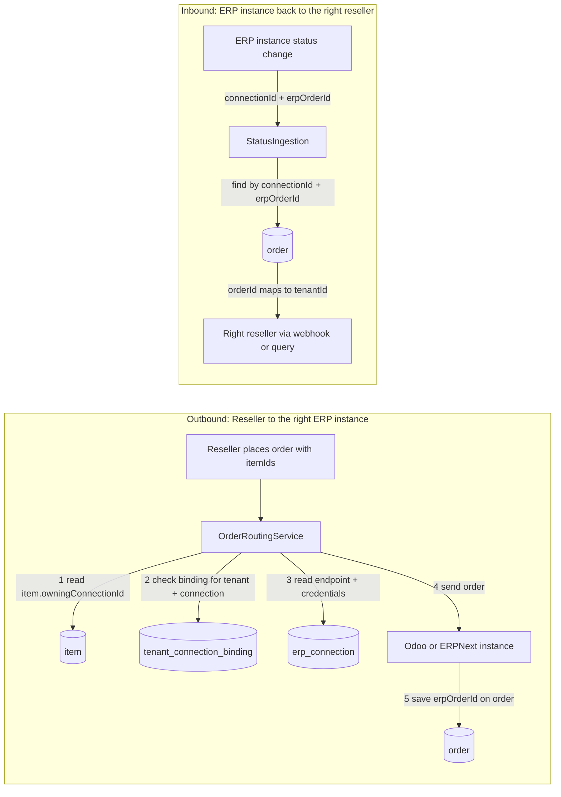
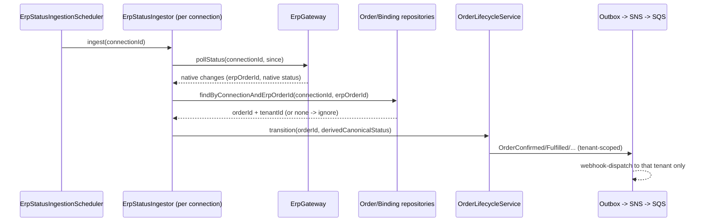

# Tenancy, Instances & Routing — ERP & Supply Chain Order Portal

This document answers four questions that the other design docs only touched:
1. Is it a microservice? How are modules separated?
2. How is an ERP **instance** mapped to the correct **reseller**?
3. How does data received **from an instance** get shared to the **right reseller** (reverse routing)?
4. How do we guarantee this never leaks across tenants?

---

## 0. At a glance — which instance, which tables



- **Outbound**: `item` (owning connection) → `tenant_connection_binding` (reseller is bound + their `erpCustomerId`) → `erp_connection` (ERP type, endpoint, credentials) → send → save `erpOrderId` on `order`.
- **Inbound**: `order` looked up by `(connectionId, erpOrderId)` → its `tenantId` is the one correct reseller.

(The detailed sequence is in Section 4.4; the entities are in Section 2.)

## 1. Architecture style & module separation

**Not microservices.** It is a **modular monolith** with three deployables:
- `api` (Spring Boot) — GraphQL, command intake, reads.
- `worker` (Spring Boot) — routing, delivery, ingestion, webhook dispatch, outbox relay.
- `ui` — two React apps (reseller, operator).

Modules are **Gradle modules inside those deployables** (Q6=C), separated by strict dependency direction:

```
:canonical-model          shared canonical entities, domain events, error codes, reseller vs operator DTOs (no deps)
:platform-infrastructure  implements the domain ports: persistence, messaging (SQS/SNS/outbox), identity (Cognito/JWT), crypto, observability
# domain capabilities (named for what they do):
:order-management  :order-routing  :erp-integration  :item-catalog
:customer-binding  :webhook-delivery  :audit-trail  :access-control
:api               thin host: composes domain + infrastructure; hosts GraphQL
:worker            thin host: composes domain + infrastructure; hosts listeners/schedulers
```

**Separation rules (enforced by module dependencies):**
- Each `:<capability>` domain module depends only on `:canonical-model` (and defines *ports* — interfaces like `ErpAdapter`, `OrderRepository`).
- `:platform-infrastructure` implements those ports (adapters); domain modules never import it.
- `:api` and `:worker` are thin hosts that wire domain + infrastructure; nothing depends on a host module.
- Reseller-facing code depends only on reseller DTOs from `:canonical-model`, so ERP identity cannot leak by construction (FR-19).

Splitting a module into its own service later is a deploy change, not a redesign, because the boundaries are already ports.

---

## 2. The entities that connect instances and resellers

```java
// One ERP instance (SAP-none-yet / one Odoo db / one ERPNext site). Operator-only identity.
record ErpConnection(
    ConnectionId connectionId,      // platform id, e.g. "conn_odoo_eu1"
    ErpType erpType,               // ODOO | ERPNEXT
    String instanceLabel,          // operator-only display, NEVER shown to resellers
    String baseUrl, AuthConfig auth, Capabilities capabilities) {}

// THE mapping between an instance and a reseller. Created and verified by the operator.
record TenantConnectionBinding(
    BindingId bindingId,
    TenantId tenantId,             // the reseller
    ConnectionId connectionId,     // the ERP instance
    String erpCustomerId,          // that reseller's customer record IN this instance (operator-only)
    BindingStatus status) {}       // TO_VERIFY | VERIFIED
// Uniqueness: UNIQUE(tenantId, connectionId)  AND  UNIQUE(connectionId, erpCustomerId)
//   -> a reseller has at most one customer per instance, and an ERP customer maps to at most one tenant (AC-05)

// Items are owned by exactly one instance; visible to a reseller only if that reseller is bound to that instance.
record Item(ItemId itemId, String sku, /* ... */ ConnectionId owningConnectionId) {}

// Every order we place records the instance and the ERP's own id -> the reverse-routing key.
record Order(OrderId orderId, TenantId tenantId, ConnectionId owningConnectionId,
             String erpOrderId /* set at send time */, /* ... */) {}
// Uniqueness: UNIQUE(connectionId, erpOrderId)
```

**So the instance↔reseller mapping is the `TenantConnectionBinding`.** One instance can serve many resellers (many bindings, each to a different `erpCustomerId`); one reseller can be served by many instances (many bindings). But any single ERP customer record belongs to at most one reseller.

---

## 3. Outbound routing (order → instance) — recap

Decided at Validated (FR-14/16/17): `OrderRoutingService` resolves the single `owningConnectionId` from the ownership of the order's items; mixed-ERP orders are rejected (FR-18). The decision is stored on the order and never changes. When delivery succeeds, we store the returned `erpOrderId` on the order.

---

## 4. Reverse routing (instance → reseller) — the previously-undocumented part

Ingestion runs **per connection (instance)**. Whatever an instance returns must be attributed to the correct reseller and to nobody else. Three cases:

### 4.1 Order status changes
```
resolveTenantForInboundOrder(connectionId, erpOrderId):
    order = orderRepository.findByConnectionAndErpOrderId(connectionId, erpOrderId)
    if order == null: ignore            // not an order we created -> never surfaced
    return order.tenantId               // deterministic, unambiguous
```
Because we only track orders we created (unique `(connectionId, erpOrderId)` → our `orderId` → its `tenantId`), an inbound status change routes to exactly one reseller. No guessing.

### 4.2 Customer data
```
resolveTenantForInboundCustomer(connectionId, erpCustomerId):
    binding = bindingRepository.findByConnectionAndErpCustomer(connectionId, erpCustomerId)
    if binding == null || binding.status != VERIFIED: do NOT publish   // FR-20
    return binding.tenantId
```
Unbound customer data is never published to any tenant.

### 4.3 Items
```
itemVisibleToTenant(item, tenantId):
    return bindingRepository.exists(tenantId, item.owningConnectionId)
```
An item synced from instance C is visible only to resellers bound to C. If two instances report the same SKU, it is flagged as an ownership conflict and withheld until the operator resolves it (FR-22).

### 4.4 Flow


---

## 5. Cross-tenant isolation guarantees
- **Attribution before publication**: every inbound record is resolved to a `tenantId` (via order linkage or binding) *before* it updates the read model or emits an event. Unresolved/unbound records are ignored, never broadcast.
- **One instance, many resellers is safe**: resolution is keyed by `erpOrderId` (orders) or `erpCustomerId` via a VERIFIED binding (customers/items), so a shared instance cannot cross-feed resellers.
- **Uniqueness enforced in the database**: `UNIQUE(connectionId, erpCustomerId)` guarantees an ERP customer maps to at most one tenant; `UNIQUE(connectionId, erpOrderId)` guarantees a single owning order.
- **No ERP identity downstream**: `connectionId`, `instanceLabel`, `erpCustomerId`, `erpOrderId` are operator-only; they never appear in reseller DTOs, webhooks, or the delivery log (FR-19). The webhook/read path carries only `tenantId` + canonical view types.
- **Tenant scope on every read**: reseller queries are additionally constrained by `TenantContext`, so even a correctly-attributed record is only queryable by its owning tenant (FR-01, AC-01).

---

## 6. Edge cases & open items
- **Reseller with no binding for an instance**: cannot see its items or place orders routed there; ordering such items fails validation with a reseller-safe message.
- **ERP customer bound to two resellers**: prevented by `UNIQUE(connectionId, erpCustomerId)` (AC-05).
- **Inbound record for an order we didn't create**: ignored (not tracked).
- **O-04**: assumes each reseller already has a customer record in each instance it buys from; onboarding match/verify (FR-21) establishes the binding.
- Detailed schemas, indexes, and the ingestion cursor/idempotency are finalized in Functional Design.
