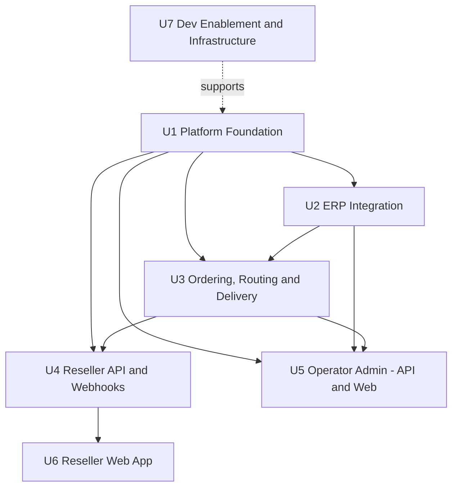

# Unit Dependencies & Build Sequence — ERP & Supply Chain Order Portal

Complements `unit-of-work.md`. Shows how units depend on each other and the approved build sequence (Q2=X: a thin end-to-end slice across **both** ERPs first, then broaden).

---

## 1. Dependency matrix

| Unit | Depends on | Notes |
|---|---|---|
| U1 Platform Foundation | — | Foundational; everything depends on it (canonical model, Axon, persistence, messaging, security) |
| U2 ERP Integration | U1 | Uses canonical model + infrastructure + credential crypto |
| U3 Ordering, Routing & Delivery | U1, U2 | Event-sourced Order + projections; routes to and delivers via U2 adapters |
| U4 Reseller API & Webhooks | U1, U3 | Reseller queries read U3 projections; mutations dispatch U3 commands |
| U5 Operator Admin (API + Web) | U1, U2, U3 | Onboarding/bindings (U1 identity + U2 verify), conflicts (U3/U2), failed messages (U3) |
| U6 Reseller Web App | U4 | Consumes reseller GraphQL |
| U7 Dev Enablement & Infrastructure | U1 (evolves with all) | Local stack, seed, IaC, CI; runs alongside from the start |

No cyclic dependencies. UI units depend only on their API units.

## 2. Dependency diagram

## 3. Build sequence (Q2=X — thin end-to-end slice, both ERPs)

**Milestone 1 — Walking skeleton across both ERPs** (proves the core premise: one canonical model fits two differently-shaped ERPs).
Minimal vertical slice through U1 → U2 → U3 → U4:
- U1: canonical model + Axon event store + tenant context (minimal).
- U2: Odoo (RPC) **and** ERPNext (REST) adapters for Sales Order create + status read; declarative mappings for both.
- U3: create → validate → route (by item ownership) → deliver → ingest status → projection.
- U4: reseller `createSalesOrder` mutation + order query (read projection).
- U7 (alongside): local Compose (Postgres + Floci + both ERP containers) + CI so the slice is runnable and testable.
- **Exit criteria**: a reseller order routes to the correct ERP and reaches Confirmed for **both** an Odoo-owned and an ERPNext-owned order; conformance tests pass against real Odoo and ERPNext containers (AC-12); no ERP identity leaks (AC-02).

**Milestone 2 — Broaden the core**: full order lifecycle (update/cancel, Retrying/Rejected, Fulfilled/Closed via multi-field status derivation O-14), guaranteed-delivery hardening (retry/DLQ/idempotency), reads-during-outage (U3 depth), webhooks + delivery log (U4).

**Milestone 3 — Operator admin (U5)**: onboarding, bindings + verification, connection health, item-ownership conflict resolution, failed-message triage, audit, mapping viewer.

**Milestone 4 — Reseller Web App (U6)**: the four reseller screens on the U4 API; plus the not-yet-designed screens (sign in, new-order form, item catalog) designed first.

**Continuous (U7)**: infrastructure, seed tool, and CI evolve throughout; Terraform/AWS environment and post-deploy smoke test firm up before any deploy.

## 4. Rationale
- Front-loading **both ERPs** in Milestone 1 de-risks the central hypothesis early rather than discovering canonical-model gaps late.
- Foundation (U1) + infra (U7) first give every later unit a stable base and a runnable/testable loop.
- Operator admin (U5) and reseller UI (U6) come after the engine works end-to-end, since they present data the engine produces.
