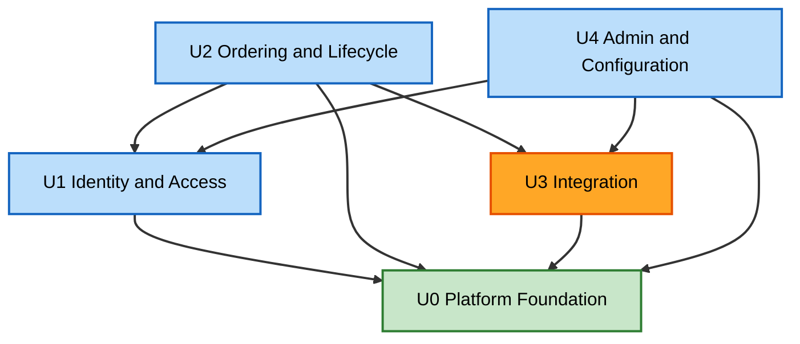

# Unit of Work Dependencies — ERP & Supply Chain Order Portal

## Dependency Matrix

Rows depend on columns (✔ = depends on).

| Depends on ↓ / → | U0 Foundation | U1 Identity | U2 Ordering | U3 Integration | U4 Admin |
|---|---|---|---|---|---|
| U0 Foundation | — | | | | |
| U1 Identity | ✔ | — | | | |
| U2 Ordering & Lifecycle | ✔ | ✔ | — | ✔ | |
| U3 Integration | ✔ | | | — | |
| U4 Admin & Config | ✔ | ✔ | | ✔ | — |

Observations:
- **U0** is a pure foundation (no outgoing dependencies).
- **U3** depends only on U0 — it is cleanly isolated, consistent with being the first extraction candidate.
- **U2** is the most connected (depends on U0, U1, U3), as it orchestrates the client experience.
- No dependency cycles.

## Communication Patterns
- **In-process interface calls** (monolith) between modules; each call crosses a defined interface from Application Design.
- **Async (via U0 queue infra)**: U2 enqueues submission/corrective jobs; U3 workers consume them. U3 also runs scheduled status-sync and webhook ingestion.
- **Config sharing**: U4 writes ERP instances / routing rules / mapping DSL into the U0 config data model; U3 reads them at runtime.

## Build/Integration Sequence (from unit-of-work.md, Q3=C)
```
U0 Foundation
   -> U1 Identity
   -> U3 Integration   (exercised with seed config)
   -> U2 Ordering & Lifecycle
   -> U4 Admin & Configuration
```

## Dependency Diagram (Mermaid)



### Text Alternative
```
U0 Foundation: depends on nothing
U1 Identity:   depends on U0
U3 Integration:depends on U0
U2 Ordering:   depends on U0, U1, U3
U4 Admin:      depends on U0, U1, U3
No cycles. U3 is the cleanest-isolated (U0 only) -> first extraction candidate.
```
