# Execution Plan — ERP & Supply Chain Order Portal

## Detailed Analysis Summary

### Change Impact Assessment
- **User-facing changes**: Yes — new external client portal (order placement, tracking, corrective actions) and a minimal internal admin UI.
- **Structural changes**: Yes — greenfield architecture centered on a canonical model + content-based router + configuration-driven adapter/mapping layer.
- **Data model changes**: Yes — new canonical data model for Sales Orders, Order Status/Tracking, Product Catalog, Inventory Availability; tenant, ERP instance, routing rule, and mapping entities.
- **API changes**: Yes — new portal APIs plus outbound integration with ERP Next and Odoo APIs.
- **NFR impact**: Yes — extensibility (primary driver), multi-tenancy/isolation, moderate-volume scale, observability. Security and resiliency baselines deferred per MVP posture.

### Risk Assessment
- **Risk Level**: Medium
- **Rollback Complexity**: Easy (greenfield; no existing production to disrupt)
- **Testing Complexity**: Moderate (mapping/routing logic and ERP integration boundaries need focused testing; PBT partial for pure functions and serialization round-trips)

## Workflow Visualization

```mermaid
flowchart TD
    Start(["User Request"])

    subgraph INCEPTION["INCEPTION PHASE"]
        WD["Workspace Detection<br/><b>COMPLETED</b>"]
        RA["Requirements Analysis<br/><b>COMPLETED</b>"]
        US["User Stories<br/><b>COMPLETED</b>"]
        WP["Workflow Planning<br/><b>IN PROGRESS</b>"]
        AD["Application Design<br/><b>EXECUTE</b>"]
        UG["Units Generation<br/><b>EXECUTE</b>"]
    end

    subgraph CONSTRUCTION["CONSTRUCTION PHASE"]
        FD["Functional Design<br/><b>EXECUTE</b>"]
        NFRA["NFR Requirements<br/><b>EXECUTE</b>"]
        NFRD["NFR Design<br/><b>EXECUTE</b>"]
        ID["Infrastructure Design<br/><b>EXECUTE</b>"]
        CG["Code Generation<br/><b>EXECUTE</b>"]
        BT["Build and Test<br/><b>EXECUTE</b>"]
    end

    subgraph OPERATIONS["OPERATIONS PHASE"]
        OPS["Operations<br/><b>PLACEHOLDER</b>"]
    end

    Start --> WD
    WD --> RA
    RA --> US
    US --> WP
    WP --> AD
    AD --> UG
    UG --> FD
    FD --> NFRA
    NFRA --> NFRD
    NFRD --> ID
    ID --> CG
    CG --> BT
    BT --> OPS
    BT --> End(["Complete"])

    style WD fill:#4CAF50,stroke:#1B5E20,stroke-width:3px,color:#fff
    style RA fill:#4CAF50,stroke:#1B5E20,stroke-width:3px,color:#fff
    style US fill:#4CAF50,stroke:#1B5E20,stroke-width:3px,color:#fff
    style WP fill:#4CAF50,stroke:#1B5E20,stroke-width:3px,color:#fff
    style AD fill:#FFA726,stroke:#E65100,stroke-width:3px,stroke-dasharray: 5 5,color:#000
    style UG fill:#FFA726,stroke:#E65100,stroke-width:3px,stroke-dasharray: 5 5,color:#000
    style FD fill:#FFA726,stroke:#E65100,stroke-width:3px,stroke-dasharray: 5 5,color:#000
    style NFRA fill:#FFA726,stroke:#E65100,stroke-width:3px,stroke-dasharray: 5 5,color:#000
    style NFRD fill:#FFA726,stroke:#E65100,stroke-width:3px,stroke-dasharray: 5 5,color:#000
    style ID fill:#FFA726,stroke:#E65100,stroke-width:3px,stroke-dasharray: 5 5,color:#000
    style CG fill:#4CAF50,stroke:#1B5E20,stroke-width:3px,color:#fff
    style BT fill:#4CAF50,stroke:#1B5E20,stroke-width:3px,color:#fff
    style OPS fill:#BDBDBD,stroke:#424242,stroke-width:2px,stroke-dasharray: 5 5,color:#000
    style INCEPTION fill:#BBDEFB,stroke:#1565C0,stroke-width:3px,color:#000
    style CONSTRUCTION fill:#C8E6C9,stroke:#2E7D32,stroke-width:3px,color:#000
    style OPERATIONS fill:#FFF59D,stroke:#F57F17,stroke-width:3px,color:#000
    style Start fill:#CE93D8,stroke:#6A1B9A,stroke-width:3px,color:#000
    style End fill:#CE93D8,stroke:#6A1B9A,stroke-width:3px,color:#000

    linkStyle default stroke:#333,stroke-width:2px
```



### Text Alternative (workflow representation)
```
INCEPTION PHASE
- Workspace Detection ......... COMPLETED
- Requirements Analysis ....... COMPLETED
- User Stories ................ COMPLETED
- Workflow Planning ........... IN PROGRESS
- Application Design .......... EXECUTE
- Units Generation ............ EXECUTE

CONSTRUCTION PHASE (per unit)
- Functional Design ........... EXECUTE
- NFR Requirements ............ EXECUTE
- NFR Design .................. EXECUTE
- Infrastructure Design ....... EXECUTE
- Code Generation ............. EXECUTE (always)
- Build and Test .............. EXECUTE (always)

OPERATIONS PHASE
- Operations .................. PLACEHOLDER
```

## Phases to Execute

### 🔵 INCEPTION PHASE
- [x] Workspace Detection (COMPLETED)
- [x] Reverse Engineering (SKIPPED — greenfield, no existing code)
- [x] Requirements Analysis (COMPLETED)
- [x] User Stories (COMPLETED)
- [x] Workflow Planning (IN PROGRESS)
- [ ] Application Design — **EXECUTE**
  - **Rationale**: New system with several distinct components (portal API, canonical model, router, adapter/mapping layer, lifecycle tracker, admin config). Component boundaries, methods, and service layering need definition.
- [ ] Units Generation — **EXECUTE**
  - **Rationale**: The system decomposes into multiple cohesive units (e.g., Ordering, Catalog/Inventory, Routing & Mapping, Lifecycle, Admin/Config, Identity/Access). Structured breakdown enables focused per-unit construction.

### 🟢 CONSTRUCTION PHASE (per unit)
- [ ] Functional Design — **EXECUTE**
  - **Rationale**: New canonical data models and non-trivial business logic (routing evaluation, mapping/translation, lifecycle state machine, corrective actions) require detailed design.
- [ ] NFR Requirements — **EXECUTE**
  - **Rationale**: Extensibility, multi-tenancy/isolation, moderate-volume scale, and observability need explicit NFRs and tech-stack selection.
- [ ] NFR Design — **EXECUTE**
  - **Rationale**: NFR patterns (tenant isolation via row-level filtering, adapter abstraction, async status ingestion) must be incorporated into the design.
- [ ] Infrastructure Design — **EXECUTE**
  - **Rationale**: Deployment target is undecided (D3=D); a recommendation and mapping to concrete services/containers is needed.
- [ ] Code Generation — **EXECUTE** (ALWAYS)
  - **Rationale**: Implementation planning and code generation for each unit.
- [ ] Build and Test — **EXECUTE** (ALWAYS)
  - **Rationale**: Build all units and run unit/integration tests; PBT partial for pure functions and serialization round-trips.

### 🟡 OPERATIONS PHASE
- [ ] Operations — PLACEHOLDER
  - **Rationale**: Future deployment and monitoring workflows; not part of MVP construction.

## Estimated Timeline
- **Total Stages to Execute**: 6 remaining (2 inception + 4 construction design stages) + Code Generation + Build and Test per unit
- **Estimated Duration**: Multiple working sessions across the units (design-heavy first, then per-unit construction)

## Success Criteria
- **Primary Goal**: A working MVP portal that lets external clients place, track, and correct orders routed to ERP Next and Odoo via a configuration-driven canonical mapping layer, designed so a new ERP is added in days.
- **Key Deliverables**: Portal UI + API, canonical model, content-based router, config-driven adapter/mapping layer for two ERPs, order lifecycle tracking with corrective actions, minimal admin UI, tenant isolation.
- **Quality Gates**: Requirements/stories traceability satisfied; mapping and routing logic covered by tests (PBT partial); build passes; integration paths to the two ERPs validated (mocked or sandbox as available).
