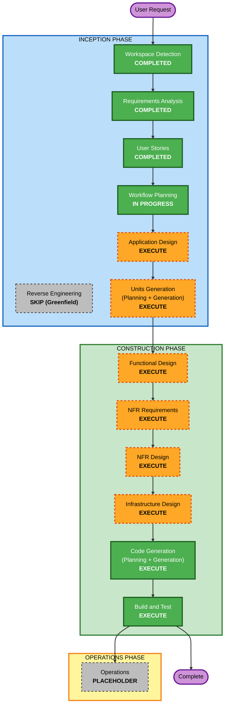

# Execution Plan — ERP & Supply Chain Order Portal

**Date**: 2026-09-21
**Project Type**: Greenfield
**Based on**: `requirements.md` (FR-01..FR-40, NFR-01..NFR-12, SECURITY/RESILIENCY/PBT extensions), `stories.md` (38 stories, 8 epics), `personas.md` (4 personas), and the UI designs in `design/`.

---

## Detailed Analysis Summary

### Change Impact Assessment
- **User-facing changes**: Yes — reseller GraphQL API, reseller web UI (4 screens), operator admin UI (6 screens), webhooks.
- **Structural changes**: Yes — a new multi-service system (modular monolith: `api`, `worker`, `ui`; identity via managed Amazon Cognito) with canonical model, routing, and mapping engine.
- **Data model changes**: Yes — canonical entities (Sales Order, Purchase Order, Item, Customer), lifecycle state machine, bindings, item ownership, outbox, delivery log, audit.
- **API changes**: Yes — new reseller GraphQL schema and a separate operator/admin schema; ERP-facing adapter calls (Odoo, ERPNext).
- **NFR impact**: Yes — guaranteed delivery, tenant isolation, encryption, observability, multi-zone; three enabled extensions (Security, Resiliency, PBT) impose blocking constraints.

### Risk Assessment
- **Risk Level**: High — system-wide greenfield build, multiple integrations, strict data-isolation rule (FR-19), guaranteed-delivery reliability, and blocking security/resiliency constraints.
- **Rollback Complexity**: N/A for the initial build (nothing in production yet); deployment rollback approach chosen (redeploy previous version, rolling — Q26/Q27).
- **Testing Complexity**: Complex — unit, integration (Testcontainers), ERP conformance (real Odoo/ERPNext), property-based, and post-deploy smoke tests.

### Complexity & Depth
- **Depth**: Comprehensive across design stages, given the scope, risk, and enabled extensions. All artifacts for each executing stage will be produced at full detail.

---

## Workflow Visualization

### Mermaid Diagram



### Text Alternative

```
INCEPTION PHASE
- Workspace Detection ....... COMPLETED
- Reverse Engineering ....... SKIP (greenfield, no existing code)
- Requirements Analysis ..... COMPLETED
- User Stories .............. COMPLETED
- Workflow Planning ......... IN PROGRESS
- Application Design ........ EXECUTE
- Units Generation .......... EXECUTE

CONSTRUCTION PHASE (per unit, then build/test)
- Functional Design ......... EXECUTE
- NFR Requirements .......... EXECUTE
- NFR Design ................ EXECUTE
- Infrastructure Design ..... EXECUTE
- Code Generation ........... EXECUTE (always)
- Build and Test ............ EXECUTE (always)

OPERATIONS PHASE
- Operations ................ PLACEHOLDER (future)
```

---

## Phases to Execute

### 🔵 INCEPTION PHASE
- [x] Workspace Detection (COMPLETED)
- [x] Reverse Engineering (SKIPPED — greenfield, no existing code to analyze)
- [x] Requirements Analysis (COMPLETED)
- [x] User Stories (COMPLETED)
- [x] Workflow Planning (IN PROGRESS)
- [ ] Application Design — **EXECUTE**
  - **Rationale**: An entirely new component/service topology is needed (canonical model, routing engine, mapping engine, adapter seam, reseller vs operator schemas, worker/outbox). Maps the ten designed screens to components, routes, and API operations.
- [ ] Units Generation — **EXECUTE**
  - **Rationale**: The system decomposes into several units that can be designed and built in sequence (candidates: Platform Core/canonical + persistence; ERP Integration/adapters + mapping + conformance; Ordering & Routing + delivery/outbox; Reseller API & Webhooks; Reseller Web UI; Operator Admin (API + UI); Identity (Cognito integration); Platform/Infra & Dev Enablement). Units are formalized in that stage.

### 🟢 CONSTRUCTION PHASE (per unit)
- [ ] Functional Design — **EXECUTE**
  - **Rationale**: New data models, the order lifecycle state machine, routing/binding/ownership rules, and PBT property identification (PBT-01) all need detailed design.
- [ ] NFR Requirements — **EXECUTE**
  - **Rationale**: Confirm scale/SLA assumptions (O-05, O-06), and formalize PBT framework selection (PBT-09) and per-unit security/resiliency requirements. Tech stack is already decided but NFR targets are not.
- [ ] NFR Design — **EXECUTE**
  - **Rationale**: Design the reliability and security patterns — transactional outbox, retry/backoff with retry + dead-letter topics, idempotency, tenant isolation, circuit breakers/timeouts, observability — and answer the resiliency testing question (RESILIENCY-14).
- [ ] Infrastructure Design — **EXECUTE**
  - **Rationale**: Map to AWS (ECS Fargate, RDS PostgreSQL Multi-AZ, SQS FIFO + SNS, Cognito, ALB) via Terraform, honoring the AWS-native rule (NFR-05) and multi-zone baseline (RESILIENCY-08; O-10 closed by managed Cognito). Floci used for local IaC smoke-tests.
- [ ] Code Generation — **EXECUTE (ALWAYS)**
  - **Rationale**: Implement each unit (Java/Spring Boot api/worker, React UI, Terraform, mappings, tests) per its design.
- [ ] Build and Test — **EXECUTE (ALWAYS)**
  - **Rationale**: Build all units; run unit, integration (Testcontainers), ERP conformance, property-based, and smoke tests.

### 🟡 OPERATIONS PHASE
- [ ] Operations — PLACEHOLDER (future deployment and monitoring workflows)

---

## Stages Skipped
- **Reverse Engineering** — greenfield; there is no existing codebase to reverse engineer.

(No Construction stages are skipped: the scope, risk, and the three enabled extensions make each design stage valuable.)

## Success Criteria
- **Primary Goal**: A working MVP where resellers place and track orders via a canonical API/UI, routed automatically to Odoo or ERPNext, with guaranteed delivery and zero exposure of ERP identity.
- **Key Deliverables**: canonical model + mapping engine, ordering & routing with outbox/retry, reseller API + web UI, operator admin, Odoo + ERPNext adapters with conformance suites, Terraform infra, one-command local stack, full test suite.
- **Quality Gates**: all acceptance criteria (AC-01..AC-17) pass; blocking Security, Resiliency, and PBT rules satisfied or explicitly N/A; FR-19/AC-02 (no ERP identity) verified on every reseller surface; one-command local environment and integration tests pass without a cloud account.

## Estimated Timeline
- **Total executing stages**: 6 remaining Inception/Construction design stages + Code Generation + Build and Test, iterated per unit (≈7–8 units).
- **Duration**: Not estimated in calendar time; sequenced per unit. Each unit is fully designed and coded before the next.
