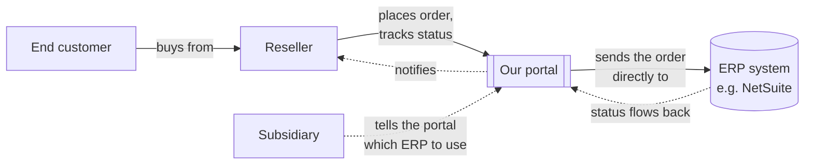
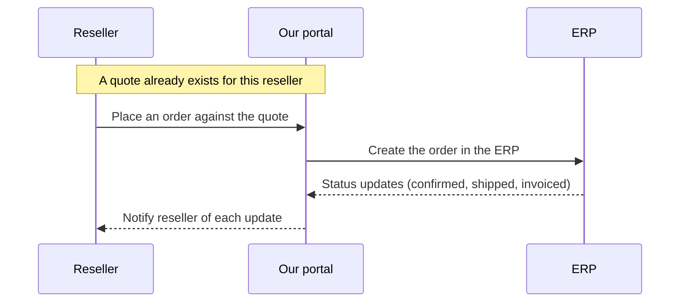

# Business case: the ERP & Supply Chain Order Portal

How we connect resellers to the right ERP, and how one order makes it all the way
through — with a real example.

---

## Where this product fits



- **Subsidiary** — one of the distributor's own entities. It doesn't sit in the data
  path at all — it's just how the portal knows *which* ERP to send an order to. That
  decision is made once (when the quote is issued) and the portal talks to the ERP
  directly from then on.
- **Our portal** — the one thing a reseller ever deals with directly. It talks straight
  to whichever ERP the subsidiary points at, and hides everything about that ERP from
  the reseller.
- **ERP system** — where the subsidiary's orders actually live and get fulfilled and
  invoiced (NetSuite today).

## Supply chain flow in scope



Quote → order submitted → order created in the ERP → status comes back → reseller is
notified. That's the loop in scope today.

## How subsidiaries connect to resellers

Before any order can go anywhere, the system has to answer two separate questions —
and it has to answer them separately, because the answer to one doesn't give you the
other:

1. **Which ERP does this order belong to?** — decided by the subsidiary.
2. **Inside that ERP, who is this reseller?** — decided separately, because the same
   reseller can be a completely different customer number in every ERP they deal with.

### Walking through one reseller, one subsidiary

- NTT India runs its own ERP — call it **NetSuite – India**. That's one fact, set once:
  *NTT India uses NetSuite – India.*
- A reseller, **Acme Distribution LLC**, buys from NTT India. Before Acme's very first
  order can go through, someone has to also tell the system a second fact: *inside
  NetSuite – India, Acme is customer CUST-4521.*
- From then on, every order Acme places under NTT India is sent to NetSuite – India, billed
  as CUST-4521 — automatically, because both facts are already on file. The order
  itself never has to say any of this; the system looks it up.

### Now add a second ERP

Acme *also* buys from **NTT Germany**, which runs its own, separate instance of
NetSuite — call it **NetSuite – Germany**. Acme isn't CUST-4521 there. They're a
different customer number entirely — say **DE-9981** — because that's a different
instance with its own customer list, even though it's the same ERP software.

So the system needs to hold two separate facts about the same reseller, one per ERP
they actually touch:

| Reseller | In this ERP... | ...they're customer |
|---|---|---|
| Acme Distribution LLC | NetSuite – India | CUST-4521 |
| Acme Distribution LLC | NetSuite – Germany | DE-9981 |

And one fact per subsidiary, saying which ERP it currently uses:

| Subsidiary | Uses this ERP |
|---|---|
| NTT India | NetSuite – India |
| NTT Germany | NetSuite – Germany |

Put an order from Acme in front of NTT India, and the system chains these two small
facts together: *NTT India → NetSuite – India*, then *Acme in NetSuite – India → CUST-4521*.
That's the whole mechanism. Adding a third subsidiary, or a third ERP, or a reseller
who buys from five subsidiaries, is just more rows in these two lists — never a change
to how the system works.

## From order to ERP, and back — the actual lookup

### 1. The lookup tables, as real records

**Which ERP instance each subsidiary uses:**

| subsidiary_id | connection_id |
|---|---|
| sub_ntt_in | conn_ns_in |
| sub_ntt_de | conn_ns_de |

**What each connection actually is:**

| connection_id | instance | address |
|---|---|---|
| conn_ns_in | NetSuite – India | india.netsuite.example.com |
| conn_ns_de | NetSuite – Germany | germany.netsuite.example.com |

**Who Acme is, inside each instance:**

| tenant_id (reseller) | connection_id | erp_customer_id | status |
|---|---|---|---|
| tnt_acme | conn_ns_in | CUST-4521 | VERIFIED |
| tnt_acme | conn_ns_de | DE-9981 | VERIFIED |

### 2. A sample quote — issued before any order exists

**What the operator actually provides** — nothing here mentions a connection or an ERP
at all:

```json
{
  "quoteId": "qot_1042",
  "tenantId": "tnt_acme",
  "subsidiaryId": "sub_ntt_in",
  "validFrom": "2026-01-01",
  "validUntil": "2026-03-31",
  "lines": [
    { "productKey": "FW-APPLIANCE-200", "unitPrice": "1250.00", "currency": "USD" },
    { "productKey": "SUPPORT-PLAN-GOLD", "unitPrice": "300.00", "currency": "USD" }
  ]
}
```

**What the system looks up and adds, right then** — table 1's lookup, run once:
*NTT India (`sub_ntt_in`) → `conn_ns_in`*.

```json
{
  "routedToConnectionId": "conn_ns_in",
  "status": "ISSUED"
}
```

**The quote, as stored** — the two merged together. This is now permanent: even if NTT
India's route later changes to a different connection, this quote keeps saying
`conn_ns_in`, because that was the route *at the moment it was issued*:

```json
{
  "quoteId": "qot_1042",
  "tenantId": "tnt_acme",
  "subsidiaryId": "sub_ntt_in",
  "routedToConnectionId": "conn_ns_in",
  "validFrom": "2026-01-01",
  "validUntil": "2026-03-31",
  "status": "ISSUED",
  "lines": [
    { "productKey": "FW-APPLIANCE-200", "unitPrice": "1250.00", "currency": "USD" },
    { "productKey": "SUPPORT-PLAN-GOLD", "unitPrice": "300.00", "currency": "USD" }
  ]
}
```

### 3. A sample order (the PO) coming in from the reseller

Acme places an order against that quote. The order itself never mentions an ERP,
a connection, or an instance — it just names the quote:

```json
{
  "tenantId": "tnt_acme",
  "quoteId": "qot_1042",
  "clientReference": "PO-2025-771",
  "lines": [
    { "productKey": "FW-APPLIANCE-200", "quantity": 4 },
    { "productKey": "SUPPORT-PLAN-GOLD", "quantity": 1 }
  ]
}
```

### 4. How we look up the right instance and send the event

1. Read the connection already stamped on the quote: `conn_ns_in`.
2. Look that connection up in table 2: **NetSuite – India**, its address and login.
3. Look up Acme's customer number for *that same connection* in table 3: **CUST-4521**.
4. Build NetSuite's own order shape and send it to that instance:

```json
// Sent to NetSuite – India only
{
  "customerId": "CUST-4521",
  "externalId": "ord_88c3a1",
  "poNumber": "PO-2025-771",
  "items": [
    { "sku": "FW-APPLIANCE-200", "quantity": 4 },
    { "sku": "SUPPORT-PLAN-GOLD", "quantity": 1 }
  ]
}
```

Three lookups, one send. Nothing here changes if Acme buys from five more subsidiaries
tomorrow — these are the same three tables, just more rows.

### 5. Getting the status back to the reseller — the same method, reversed

NetSuite – India later reports a status change against *its own* order number,
`NS-IN-55312`. The system runs the same kind of lookup backwards:

| connection_id | erp_order_id | our order_id |
|---|---|---|
| conn_ns_in | NS-IN-55312 | ord_88c3a1 |

`ord_88c3a1` belongs to `tnt_acme`, and Acme's own notification address is on file,
the same way their customer number was. So:

```json
// Delivered to Acme's own system
{
  "event": "OrderConfirmed",
  "orderReference": "PO-2025-771",
  "status": "CONFIRMED"
}
```

Acme never sees `NS-IN-55312`, `CUST-4521`, `conn_ns_in`, or even the word "NetSuite" —
every ERP-side detail stays behind the two lookup tables. Same mechanism both
directions: look it up, don't ask the reseller for it.
