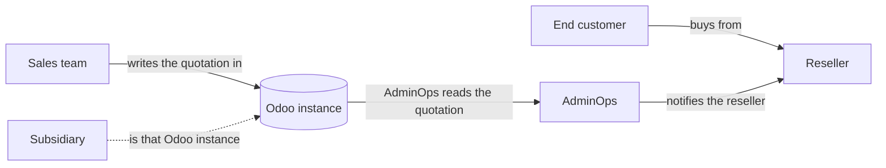
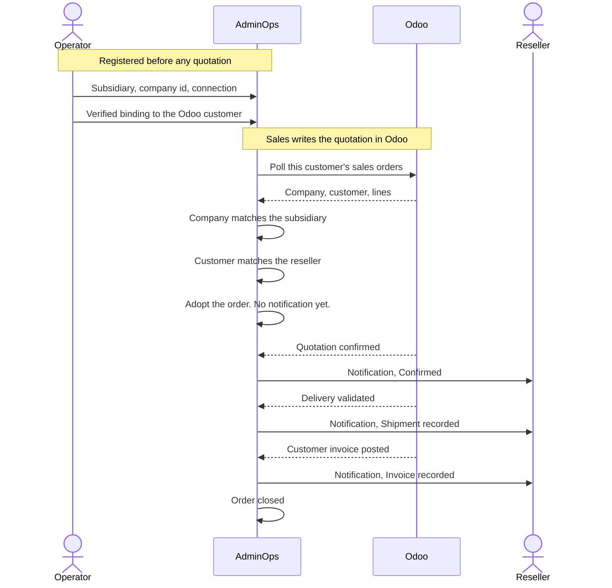
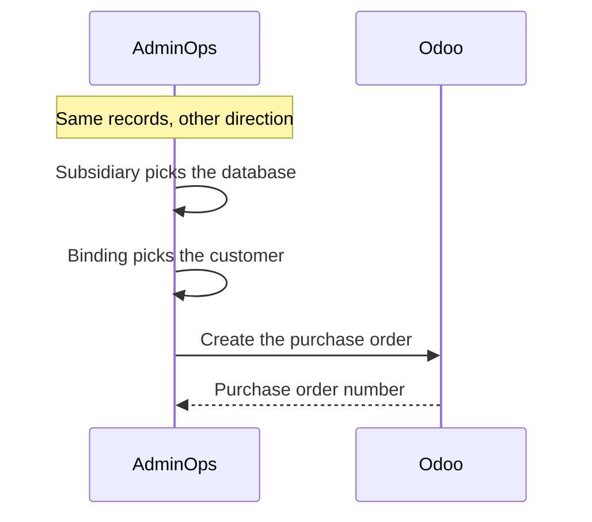

# Business case: AdminOps

How a quotation written in the ERP reaches the right reseller, and how confirmation, delivery, and invoice follow it back.

Odoo is the ERP we run today. A second Odoo database is another connection. A different ERP product uses the same records once its adapter exists.

## Where this product fits

- **Subsidiary** — one of the distributor's own companies. One subsidiary is one ERP instance. NTT India is one Odoo database. NTT Germany is another.
- **AdminOps** — the distributor's application. It reads the ERP, shows every order, and shows every notification sent to a reseller. There is no reseller screen. The reseller receives the webhook on their own system.
- **ERP** — where sales writes the quotation, confirms it, delivers it, and invoices it. AdminOps does not create that quotation. Odoo itself is sometimes called a portal. This product is not that.

## What has to be registered first

Three records exist before any quotation is picked up. The quotation has to match them. A company or a customer that was not registered stays in the ERP.

| Record | What it says | Example |
|---|---|---|
| Connection | Which database we log into | `conn_odoo_in` → Odoo India |
| Subsidiary route | That database is this subsidiary, and which company id inside it | NTT India → `conn_odoo_in`, company `1` |
| Reseller binding | Inside that database, which customer is this reseller. Status must be verified | Acme in Odoo India is customer `42` |

One database belongs to one subsidiary. A second subsidiary cannot use it. A reseller who buys from two subsidiaries has two bindings, each with that database's own customer id.

| Reseller | Subsidiary | Database | Customer id there |
|---|---|---|---|
| Acme | NTT India | Odoo India | 42 |
| Acme | NTT Germany | Odoo Germany | 77 |

## The flow we run

Saving the quotation is enough for the distributor to see the order in AdminOps. The reseller's system is notified when it is confirmed, when a delivery is validated, and when the customer invoice is posted. Cancelling it in Odoo can notify as well. AdminOps lists those notifications.

A quotation and a sales order are the same Odoo document. Confirming it is the step that changes status.

### Acme, one quotation

1. An operator has already registered NTT India on Odoo India, company `1`, and verified that Acme is customer `42` there.
2. Sales, in Odoo India, saves a quotation for customer `42` on company `1`. The product line has an Internal Reference. The number looks like `S00042`.
3. The next poll adopts it. AdminOps shows the order. Acme's system has not been notified yet.
4. Sales confirms the quotation. Acme's system gets a Confirmed notification. AdminOps shows that notification.
5. The warehouse validates the delivery. Acme gets a shipment notification. Shipped and delivered quantities move.
6. Finance posts the customer invoice. Acme gets an invoice notification. The order closes.

AdminOps shows when the notification was sent, which reseller it went to, which event it was, and the order behind it, including the Odoo order number.

A quotation for a different company, or for a customer with no verified binding, is left in Odoo.

## Both directions use the same records

**Odoo to the reseller.** The poll is already inside one database. The customer on the quotation picks the reseller. The company on the quotation picks the subsidiary.

**The reseller's subsidiary back to the right Odoo.** The subsidiary's route is the database. The binding on that database is the customer id. Acme buying from NTT India can only land in Odoo India, as customer `42`. Acme's German binding is a different row and is not used.

## Later — creating a purchase order

The same two lookups aim a purchase order when we create one. That call is not built yet. The read flow above does not change when it is added.

## What this flow leaves out

- A second ERP product, until its adapter is written. Another Odoo database does not need one.
- A screen for switching between instances. Orders are one list. The connection is a column on the operator's row.
- Credit notes. A posted customer invoice counts. A refund does not reduce the invoiced quantity.
- A vendor purchase-order number on the quotation. We do not read one.
