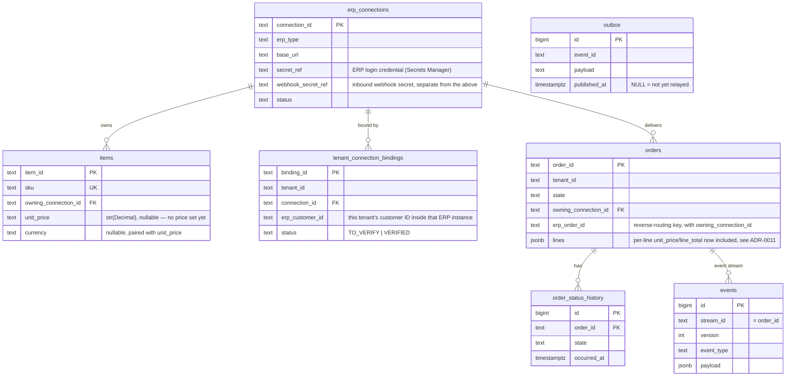

# Database schema

One PostgreSQL database (see `aidlc-docs/inception/application-design/target-architecture.md`
§6 for why one, not several).
Defined across Alembic migrations in `migrations/versions/`: `0001_target_architecture`
(everything except the rows below), `0002_order_lines` (added `orders.lines`),
`0003_webhook_secret_ref` (added `erp_connections.webhook_secret_ref`), `0004_webhook_outbound`
(rebuilt `webhook_endpoints`, added `webhook_deliveries`), `0005_item_price` (added
`items.unit_price`/`items.currency`). This doc is the "what's actually there" reference
that didn't exist before — if you add a column, update this file in the same change.

## Diagram

## Tables, grouped by what they're for

### The event store — source of truth for orders
- **`events`** — every fact that ever happened to an order (`OrderSubmitted`,
  `OrderValidated`, `OrderSentToErp`, `OrderConfirmed`, …), one row per event, never
  updated or deleted. `stream_id` is the order id; `(stream_id, version)` is unique,
  which is how concurrent writers get a clean conflict instead of corrupting state. See
  `docs/event-sourcing-explained.md` — this table *is* event sourcing.
- **`snapshots`** — an optional fast-forward: the aggregate's state as of some version,
  so replay doesn't have to start from event 1 for a long-lived order. Not required
  correctness-wise, purely a read-speed optimization.

### The outbox — how events leave the database safely
- **`outbox`** — a copy of each event written in the *same transaction* as the `events`
  row (see the write path in `target-architecture.md` §3). A background relay
  publishes unpublished rows (`published_at IS NULL`) to SNS, then marks them published.
  This is what makes "append an event" and "notify everyone else" atomic without a
  distributed transaction — either both happen or neither does.
- **`processed_events`** — the flip side, on the *consuming* end: `(consumer, event_id)`
  pairs already handled, so a redelivered message (SQS is at-least-once) is a safe no-op
  instead of double-processing.
- **`erp_event_inbox`** — one row per authenticated inbound ERP webhook (`0011_erp_event_inbox`).
  `body` is the raw request bytes. The payload is not parsed into columns.

### Config / tenancy — which ERP, whose order, who's allowed
- **`erp_connections`** — one row per ERP *instance* (e.g. one specific Odoo database —
  see `docs/erp-integration-patterns.md` for how multiple instances of the same or
  different ERPs coexist). Holds connection details and two *separate* secrets:
  `secret_ref` (how we log into the ERP) and `webhook_secret_ref` (how we verify the ERP
  is really the one calling our webhook) — deliberately not the same secret, so leaking
  one doesn't leak the other.
- **`tenant_connection_bindings`** — links a reseller (`tenant_id`) to one ERP connection,
  with `erp_customer_id` (their customer id *inside that ERP*). Two uniqueness rules do
  the heavy lifting: a tenant has at most one binding per connection, and an ERP customer
  maps to at most one tenant — together these are what make routing an inbound webhook
  back to the right reseller unambiguous.
- **`items`** — which connection "owns" a SKU. An order can only route to one connection,
  so every line's item must resolve to the *same* owning connection or the order is
  rejected (`mixed_erp`) before anything is sent anywhere. Also the price source: `unit_price`/
  `currency` are resolved onto an order's lines at submission time, never trusted from the
  reseller (ADR-0011) — both nullable, since not every item has a price set yet.

### Projections — the fast, read-only copy GraphQL actually queries
- **`orders`** — one row per order, kept in sync by replaying events (see the projector
  in the architecture diagram). `(owning_connection_id, erp_order_id)` is unique and
  doubles as the **reverse-routing key**: given a connection + the ERP's own order id (all
  an inbound webhook typically carries), this is how we find *our* order id.
  `lines` is JSONB (added in migration `0002` — the schema didn't originally have
  anywhere to put line items).
- **`order_status_history`** — the timeline a reseller sees (`Submitted → Validated →
  Sent to ERP → Confirmed → …`). Consecutive duplicate labels are skipped (two internal
  states can share one reseller-facing label — see `ordering/projections/store.py`).

### Not yet wired up
- **`webhook_endpoints`** — for *outbound* webhooks (us pushing to a reseller), the
  secondary/optional read path per the design. Table exists; nothing writes to it yet.
- **`audit_log`** — generic before/after audit trail. Table exists; nothing writes to it
  yet (Phase 3 item G/H territory — security hardening for the AWS deployment).

## Defense in depth: row-level security

`orders` and `order_status_history` have Postgres RLS policies that only allow reads
where `tenant_id = current_setting('app.tenant_id')`. **This is currently inert**: the
local dev Postgres role (`portal`) owns these tables, and table owners bypass RLS by
default — nothing calls `SET app.tenant_id` yet either. It's real defense-in-depth once a
non-owner application role and `bind_tenant()` calls are wired up (tracked as an open
Phase 3 item, see `aidlc-docs/aidlc-state.md`), but right now tenant isolation is
enforced entirely at the application layer (every query filters by `tenant_id`
explicitly) — RLS would only catch a bug that bypassed that filtering, and today it
can't even do that.
