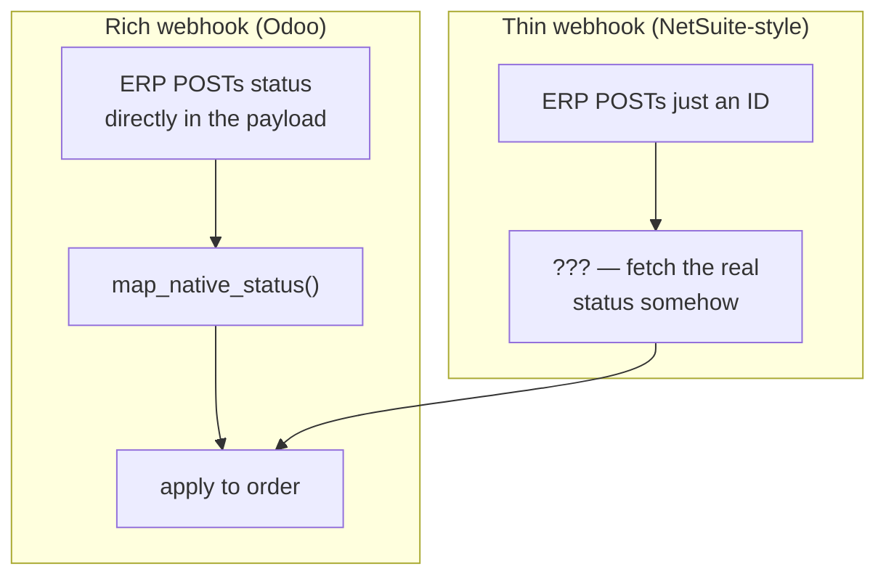
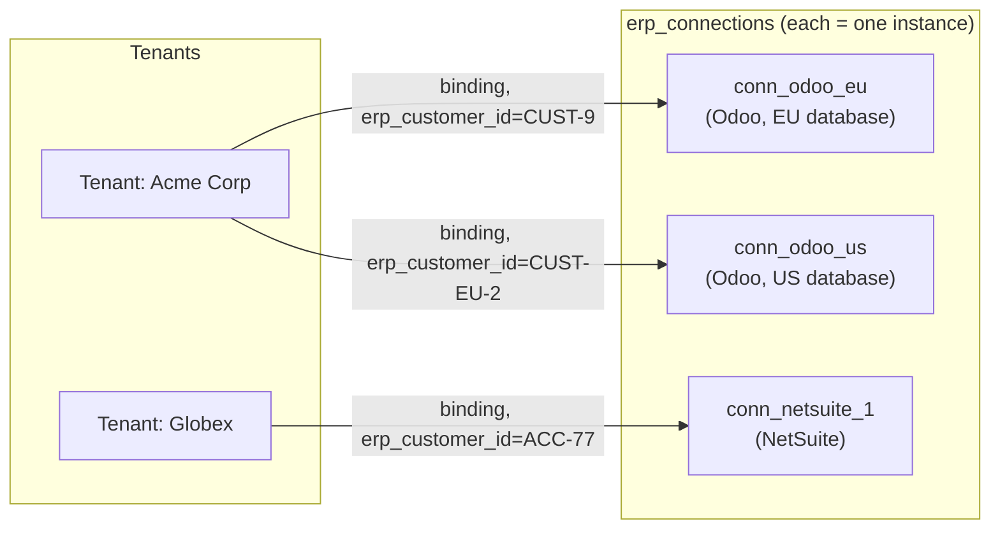
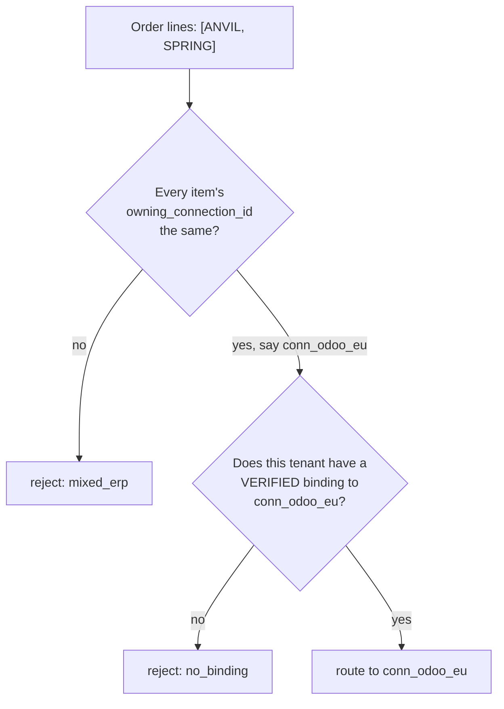
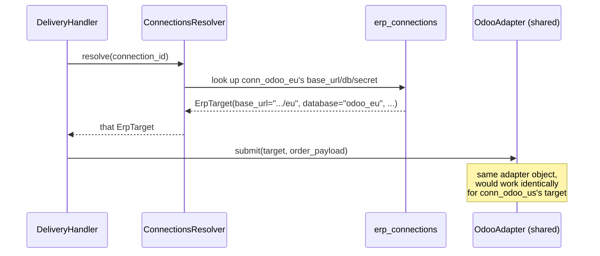

# ERP integration patterns: webhooks, and multiple instances/tenants

Two questions this answers: *"what if an ERP's webhook only sends an ID and expects us to
fetch the rest (NetSuite-style)?"* and *"how do multiple ERP instances and multiple
tenants not get tangled up with each other?"*

## 1. Webhook shapes: "rich" vs "thin"

Not every ERP's webhook carries the same amount of information.

- **Rich webhook** (Odoo, as built): the payload already contains the new status —
  `{"erp_order_id": "S00042", "state": "sale"}`. We map that status string straight to a
  `CanonicalStatus` and apply it. No extra API call needed.
- **Thin webhook** (NetSuite and others): the payload is closer to
  `{"record_id": "SO123", "event": "updated"}` — just enough to say *something* changed,
  not *what*. The expectation is that you call the ERP's API to fetch the current record.

### Do we support the thin pattern today? Honestly: not on the fast path.

`InboundWebhookService` (`webhooks_inbound/application/ingress.py`) only receives a
`SecretResolver`, `DedupStore`, `OrderLocator`, and `OrderStatusPort` — it has **no way to
call back into the ERP**. If a thin webhook arrives with no status in the payload,
`map_native_status` gets an empty string, matches nothing, and the outcome is
`NO_TRANSITION`. The webhook is authenticated and acknowledged correctly (not an error),
it just doesn't do anything useful.

**This degrades gracefully, it doesn't break.** The reconciliation sweeper
(`ReconcileScheduler`, item C) already calls `adapter.fetch_status(target, erp_order_id)`
on a schedule (every `RECONCILE_INTERVAL_SECONDS`, default 900s/15min) for every open
order, completely independent of whether webhooks work at all. So a NetSuite-style
connection today would just run in **polling-only mode automatically** — correct
eventually, but on a 15-minute cadence instead of near-real-time.

### What closing the gap looks like

Not built (this is a scope decision, not a limitation of the design — flagging it here so
it's a decision, not a surprise later):

1. Give `InboundWebhookService` an optional `adapter_for` + `connections: ConnectionResolver`
   (the same two things `DeliveryHandler`/`ReconcileSweeper` already use).
2. In `handle()`, if `webhook.native_status` is empty, call
   `adapter.fetch_status(target, webhook.erp_order_id)` instead of trusting the payload,
   *then* run the result through the same `map_native_status` path.
3. That's it — everything downstream (attribution, dedupe, applying the status) is
   already ERP-agnostic and wouldn't need to change.

This is a small, well-contained addition specifically *because* `fetch_status` already
exists on `ErpAdapter` (`odoo_adapter.py` implements it) and is already exercised by the
reconcile sweeper — it's proven code, just not wired into the webhook path yet.

## 2. Multiple ERP instances and multiple tenants

Short answer: **this already works today**, and it's not a special case — it's just what
the data model does by default. Two different things can both be true at once:

- **One reseller (tenant) can be bound to several ERP connections** — e.g. they buy from
  both your EU Odoo and your US Odoo.
- **Several connections can be the same ERP *type*** — e.g. two separate Odoo databases —
  or **different types** — e.g. one Odoo and one NetSuite, both live at once.

Acme Corp above has *two* verified bindings — to `conn_odoo_eu` and `conn_odoo_us` — with
a *different* `erp_customer_id` in each, because they're a different customer record
inside each separate Odoo database. Nothing about the schema or the routing logic assumes
"one tenant, one connection."

### How an order actually gets routed to the right instance

Routing isn't based on which tenant is placing the order — it's based on **which
connection owns the items in the order** (`ordering/domain/routing.py`,
`resolve_owning_connection`):

So: items decide the *which instance*, the binding decides *is this tenant even allowed
to order from it*. A single order can never span two connections — that's the
`mixed_erp` rejection — by design, since one order can only be delivered to one ERP.

### How one adapter instance safely serves many connections

You might expect "two Odoo databases" to need two `OdooAdapter` objects. It doesn't.
`OdooAdapter` (and any adapter) is **stateless between calls** — every method takes an
`ErpTarget` (`base_url`, `database`, `username`, `secret`) as an argument, resolved fresh
per-connection right before the call:

So the adapter *registry* (`docs/adding-an-erp.md`) is keyed by **ERP type**, not by
connection — one `OdooAdapter` instance handles every Odoo connection you configure.
Adding a second Odoo instance is purely a `scripts/seed_demo.py`-style data change (a new
`erp_connections` row + a new binding); it needs zero code changes, because the adapter
never assumed there was only one Odoo out there to begin with.

## Read next
- `docs/adding-an-erp.md` — the checklist for registering a new ERP type.
- `docs/erps/` — concrete, per-ERP facts (Odoo's specific quirks, auth, API shape) —
  this doc covers patterns that apply across ERPs; that folder covers one ERP each.
- `docs/odoo-webhook-setup.md` — Odoo's specific (thin-in-a-different-way: unsigned)
  webhook constraint and how the shared-secret-in-path route works around it.
- `docs/database-schema.md` — the tables `erp_connections`/`tenant_connection_bindings`/
  `items` referenced throughout this doc.
