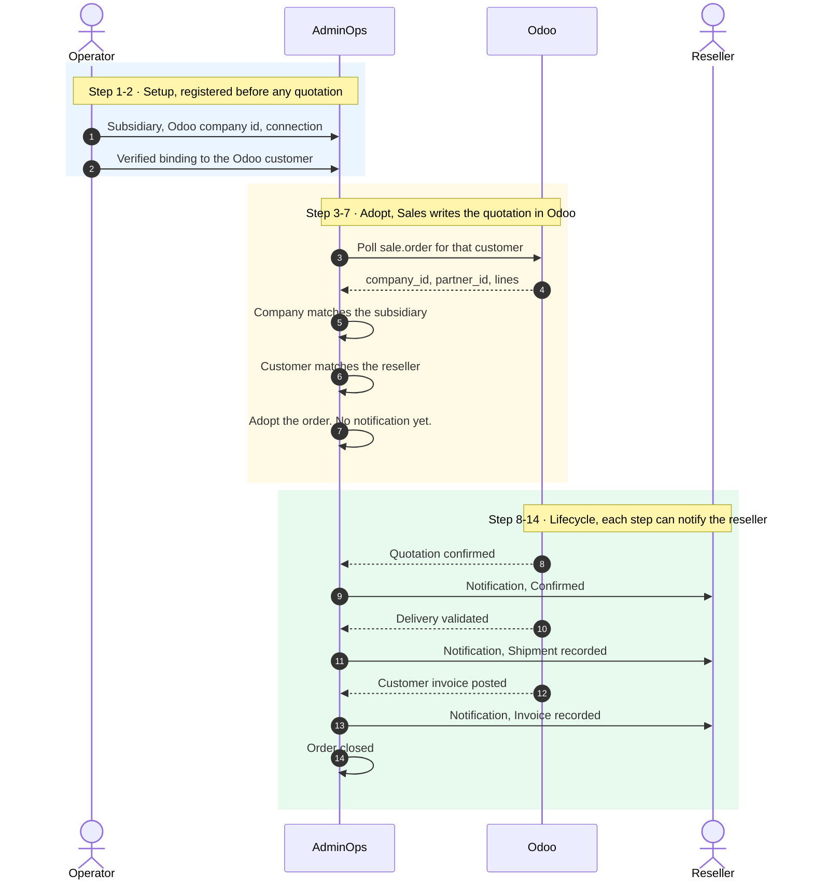
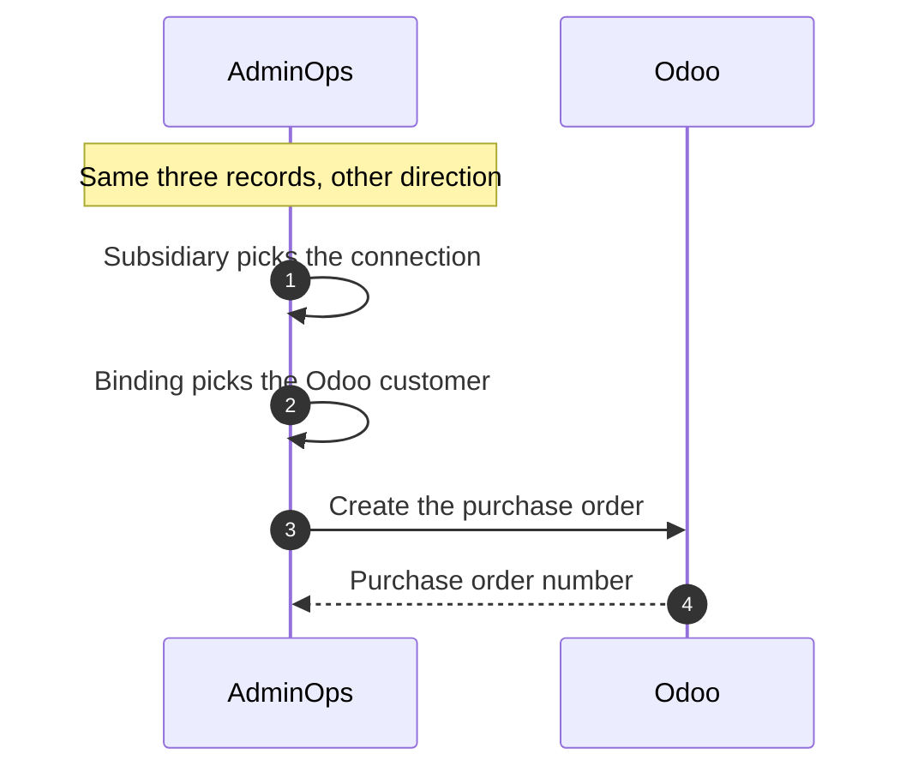

# ERP scope — answers

Answers for the current product. Odoo is the ERP we run against. Sales creates the quotation there. We read it, follow delivery and invoice, and show the reseller the notifications we actually sent. A purchase order can be created later from the same records. That call is not built yet.

## The two flows

Each ERP instance is one subsidiary. That instance can be an Odoo database, another Odoo database, or a different ERP once its adapter exists. The operator registers the subsidiary and a verified reseller binding on that instance before any quotation. The quotation has to match them. A second subsidiary cannot use that same instance.

A reseller is connected to whichever instances they buy from, one binding per instance, with that instance's own customer id. They are not connected to the others. An order is adopted only on an instance where their binding is verified. A purchase order later uses the same records in the other direction.

### Now — the quotation is created in Odoo

Saving the quotation adopts the order and does not notify. Confirm, delivery, and invoice are the steps that can notify. A company or customer that was not registered is left in Odoo.

### Later — this product creates the purchase order

Each ERP instance stays one subsidiary on that later call too. Nothing in the read flow above changes when the purchase order is added.

## Which ERP?

**Odoo Community**, for the MVP and for the first live ERP.

It is free, it already has Sales, Inventory, and Invoicing, and it is the only ERP this platform talks to today. Local setup starts an Odoo 17 database with AdminOps, so a walkthrough does not need a paid licence or a second vendor.

A later ERP (SAP, NetSuite, ERPNext) is a separate adapter. It is not part of this scope.

## Which order movements do we follow?

We follow one Odoo sales order from the moment it exists for a linked customer, through delivery, to the customer invoice.

| Step in the business | Odoo document | What we do |
|---|---|---|
| Quotation saved | `sale.order` while it is still a draft or sent | We adopt it on the next poll. Status stays "sent to ERP". Saving it does not notify the reseller. |
| Sales order confirmed | Same `sale.order`, state `sale` or `done` | Status becomes **Confirmed**. This can notify the reseller. |
| Delivery validated | A done `stock.picking` on that order | We record shipped quantities. A physical line counts as delivered when that picking is done. This can notify the reseller. |
| Customer invoice posted | A posted `account.move` of type customer invoice | We record invoiced quantities. When Odoo marks the order invoiced, status becomes **Closed**. This can notify the reseller. |
| Cancelled in Odoo | `sale.order` state `cancel` | Status becomes **Cancelled**. This can notify the reseller. |

A quotation and a sales order are the same Odoo document. Confirming it is the movement that changes status.

**A purchase order is the later flow above.** We do not create one today, and we do not read a vendor purchase order number onto the quotation. Credit notes stay out of scope: a posted customer invoice counts, a refund does not reduce the invoiced quantity.

## Which fields does the ERP have to supply?

The order is skipped when a required field is missing. A line with no product code, or a quantity of zero, is dropped. If every line is dropped, the order is not created here.

### Sales order (`sale.order`)

| Odoo field | Required | What we store it as |
|---|---|---|
| Customer (`partner_id`) | Yes | Must match a verified binding. Orders for any other customer are ignored. |
| Company (`company_id`) | Yes | The subsidiary on the quotation. Must match a subsidiary's Odoo company id. Any other company is not adopted. |
| Order number (`name`, e.g. `S00042`) | Yes | ERP order id. The AdminOps order id is `ord_{connection}_{this number}`. |
| Customer reference (`client_order_ref`) | No | Shown to the reseller as the order number. If blank, we use the Odoo order number. |
| Currency (`currency_id`) | No | Defaults to USD. |
| Order state (`state`) | Yes, to move status | `sale` / `done` confirms. `cancel` cancels. `draft` and `sent` leave status unchanged. |
| Invoice status (`invoice_status`) | Yes, to close | `invoiced` closes the order. |

### Each product line (`sale.order.line`)

| Odoo field | Required | What we store it as |
|---|---|---|
| Product Internal Reference (`product.product.default_code`) | Yes | Product key. This is the SKU the reseller sees. |
| Quantity (`product_uom_qty`) | Yes, greater than zero | Ordered quantity. |
| Unit price (`price_unit`) | No | Price on the line. Blank is allowed. |

Section and note lines are ignored. Only real product lines count.

### Delivery (done `stock.picking`)

| Odoo field | Required | What we store it as |
|---|---|---|
| Picking id | Yes | Stable id, so a later poll does not add the same quantity again. |
| Picking name | Yes | Proof of delivery. |
| State | Yes | Only `done` counts. |
| Move product Internal Reference | Yes | Same product key as the order line. A SKU that is not on the order is skipped. |
| Move quantity | Yes, greater than zero | Quantity shipped on this delivery. |

### Customer invoice (posted `account.move`)

| Odoo field | Required | What we store it as |
|---|---|---|
| Invoice id | Yes | Stable id across polls. |
| Invoice number (`name`) | Yes | The number we show. |
| State and type | Yes | Only `posted` and customer invoice (`out_invoice`). Drafts and credit notes are ignored. |
| Line product Internal Reference | Yes | Same product key as the order line. |
| Line quantity | Yes, greater than zero | Quantity invoiced on this invoice. |

### Connection (set once by an operator, not on the order)

| Field | What it is |
|---|---|
| Odoo URL | The database we log into, for example `http://localhost:8069`. |
| Database name and username | Non-secret login fields. |
| Password | Stored as a secret reference, not in the connection row. |
| Webhook secret | Proves an inbound status call from Odoo. Status still moves on the poll if this is unset. |
| Reseller binding | Reseller + this connection + the Odoo customer id (`res.partner` id). Status must be verified. |

## Who creates the order, and which reseller does it belong to?

**Sales creates the quotation and the sales order in Odoo.** This product does not issue the quote. The poll reads `sale.order` rows that are already there. Creating a purchase order is the later flow, and it is not built yet.

An order reaches a reseller only when an operator has verified a binding: this reseller, this Odoo database, this Odoo customer id. The sweep reads that customer's orders and no one else's. One customer id on one database belongs to one reseller, so two resellers cannot both receive the same order.

The subsidiary is the company on that same quotation (`company_id`). An operator records that Odoo company id on the subsidiary. Adopt stores that subsidiary on the order. A quotation whose company is not recorded is not adopted, and the reseller gets no notification.

If the customer binding is missing or not verified, the order stays in Odoo and never shows up here.
