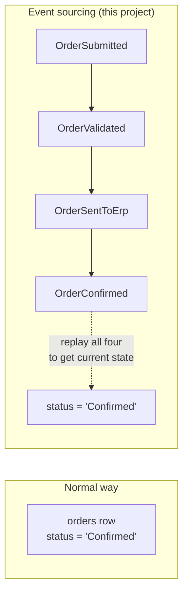
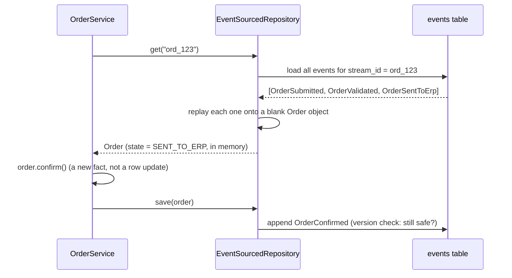

# Event sourcing, explained simply

This project stores orders as a sequence of **events** instead of just overwriting a row
each time something changes. If that sounds unfamiliar, this page is for you. For the
code-level API (classes, how to write a new event-sourced aggregate), see
`src/shared/eventsourcing/README.md` — this page is the "why" and "what", that one is
the "how".

## The normal way vs. this way

**Normal way** (most apps): an `orders` table has a `status` column. Placing an order
inserts a row with `status = 'Submitted'`. Confirming it runs
`UPDATE orders SET status = 'Confirmed' WHERE id = ...`. The old value is gone — the
database only remembers *what is true now*, not *what happened*.

**Event sourcing**: instead of overwriting, you append a new fact every time something
happens: `OrderSubmitted`, then later `OrderValidated`, then `OrderSentToErp`, then
`OrderConfirmed`. The order's current status isn't stored directly at all — it's
*computed* by replaying all of its events in order. Nothing is ever overwritten.

## Why bother — three concrete reasons this project needed it

1. **A full history for free.** The reseller-facing timeline ("Submitted → Validated →
   Sent to ERP → Confirmed") *is* the event list, formatted. No separate "activity log"
   table to keep in sync — it can't drift from reality because it's the same data.

2. **Safe concurrent writes.** Two things trying to update the same order at once is a
   classic bug source. Here, every event records the version it expects
   (`(stream_id, version)` is unique in the `events` table — see
   `docs/database-schema.md`). If two writers race, the second one's version doesn't
   match anymore and it gets a clean error instead of silently clobbering the first.

3. **The outbox falls out for free.** Because "what changed" is already a list of
   discrete facts, publishing "an order-related event just happened" to the rest of the
   system (the worker, other services) is just "publish this event" — not "diff the
   before/after of a row and guess what changed." See the outbox section in
   `docs/database-schema.md`.

## Only where it earns its keep

**Only the *transactional* aggregates are event-sourced** — `Order`, and the
fulfillment family it spun off (`Shipment`, `Invoice`), which reuse
the exact same kernel (ADR-0014). Reference/config data — connections, items, tenant
bindings, quotes, subsidiaries — are plain rows, updated in place, like a normal
app, because they don't have an interesting lifecycle worth replaying. This is a deliberate
choice
(`src/shared/eventsourcing/README.md` calls it out explicitly): event sourcing is a tool
for aggregates with real state machines and a history worth keeping, not a house style to
apply everywhere. Using it for `erp_connections` would just be ceremony for no benefit.

## How "current state" actually gets computed

Two things worth noticing:
- **Nothing is "loaded from a status column."** The in-memory `Order` object is rebuilt
  from scratch, every time, by replaying its events. That's slower per-read than a plain
  `SELECT status`, which is why snapshots exist (a checkpoint so replay doesn't start
  from event 1 for a long-lived order) — but it's the thing that makes reasons 1–3 above
  true.
- **A "command" (`order.confirm()`) doesn't change anything by itself.** It records that
  `OrderConfirmed` happened; the actual state change happens when that event is
  *applied* (both immediately, in memory, and again every time the order is replayed
  later). This is what "behavior lives in the aggregate" means in the kernel's README.

## CQRS: why there's also a separate `orders` table

If everything above is true, why does `docs/database-schema.md` also list a plain
`orders` table with an ordinary `status` column? Because replaying events on every
GraphQL read would be needlessly slow, and a reseller's `orders` query has no business
touching the event store at all. So a **projector** listens for new events and maintains
a fast, ordinary, read-only copy — the `orders` table — purely for queries. Writes go
through events; reads go through the projection. That split is what "CQRS"
(Command Query Responsibility Segregation) means here — it's not a separate technology,
just this pattern: events are truth, projections are a cache that's rebuilt from truth
whenever needed.
